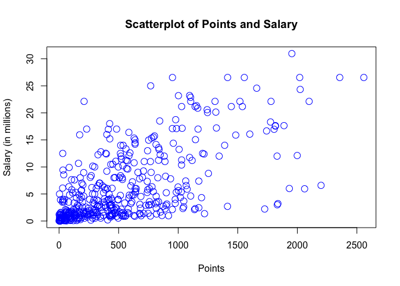
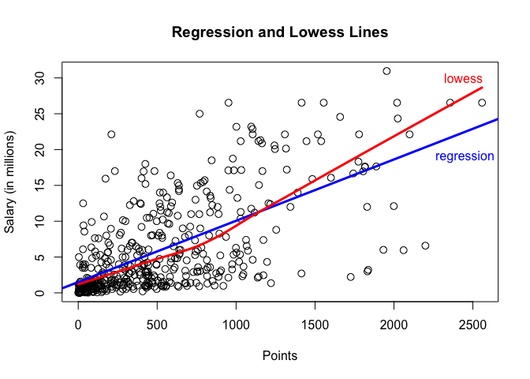
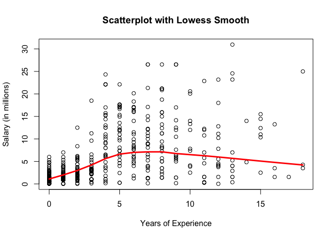
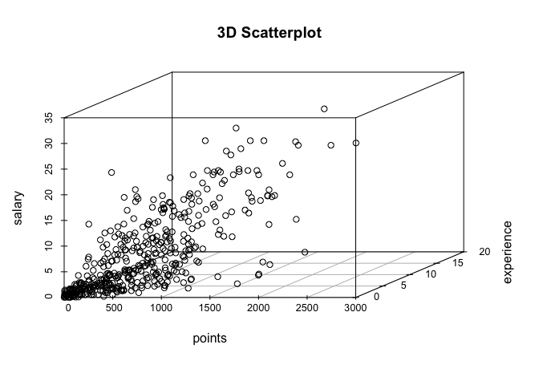
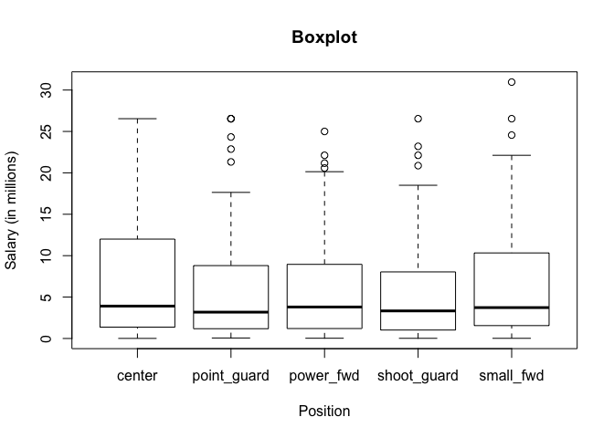

HW01 - More Vectors
================

###### *Stat 133, Fall 2017, Prof. Sanchez*

#### Hannah Kim, Lab Section 104

### Data

``` r
#importing the NBA salary & points data
load("data/nba2017-salary-points.RData")
ls()
```

    ## [1] "experience" "player"     "points"     "points1"    "points2"   
    ## [6] "points3"    "position"   "salary"     "team"

**Research Question: The more points a player scores, the higher his salary?**
------------------------------------------------------------------------------

### 1. A Bit of Data Preprocessing

Purpose: creating new variables for salaries in millions, years of experience, and positions

``` r
#new salary variable in millions (2 decimal digits)
salary_millions <- round(salary/1000000, digits = 2)
salary_millions
```

    ##   [1] 26.54 12.00  8.27  1.45  1.41  6.59  6.29  1.83  4.74  5.00  1.22
    ##  [12]  3.09  3.58  1.91  8.00  7.81  0.02  0.26  0.27  0.01  9.70 12.80
    ##  [23]  1.55  0.54 21.17  5.24 17.64 30.96  2.50 15.33  1.59  7.33  1.58
    ##  [34] 26.54 14.20  0.54  2.70 14.38 12.00  1.92  0.87  5.30  1.20  6.05
    ##  [45] 12.25  3.73 22.12  1.20  1.19  0.54 15.94  5.00 16.96 12.00  7.40
    ##  [56]  5.89  0.54  2.87  3.39  1.50  2.71 23.18  8.40  0.39 15.73  4.00
    ##  [67]  2.50  4.84  1.02 20.07  0.42  3.85  2.28  3.00 17.10  5.37  1.55
    ##  [78] 12.52 15.20  0.92  9.61  1.40 10.50  1.81  6.35  2.57  2.37  2.70
    ##  [89] 10.23  4.58  0.65  8.80  1.05  1.80  4.00  4.00 10.77  2.46 18.31
    ## [100]  1.05 14.15  3.49  1.45  2.11  0.87  2.09 23.20  1.02  1.64 17.55
    ## [111]  1.71  3.18  5.78  0.75 14.00 13.22  2.90 15.89 22.12  4.00  5.78
    ## [122]  0.87  2.59  1.23  0.21  0.54  5.63  4.00  6.00  1.02 22.12  6.50
    ## [133]  1.55  7.00  0.87  1.70  6.00 10.99  3.68  4.62  0.65  2.26 14.96
    ## [144]  2.97 17.20  1.05  0.10  0.87  5.32  2.73  6.51  0.16 12.00  6.33
    ## [155] 12.25 13.00 12.50 20.87  6.00  0.54 24.56  0.14 11.24 21.32 17.00
    ## [166]  1.02  4.32  3.90  6.19  0.54  0.54  2.90  0.54  1.41  1.38  4.35
    ## [177] 17.00  5.00  7.25  0.98  2.61 17.00 15.00  6.54  0.03  3.91 11.75
    ## [188]  0.03  0.95 10.00  0.03  2.32  9.00  4.79  9.42  4.83  1.51  2.99
    ## [199]  1.03  1.02  8.00  0.09  0.87  8.55  1.33  6.09  0.12 21.17  1.56
    ## [210]  1.07 11.48  0.98  3.00  3.33  1.79  2.50  1.40  0.98  0.73  9.25
    ## [221] 11.13  1.17  1.55 15.33  1.02  0.98  1.40 26.54  1.18 16.66  0.38
    ## [232]  0.54  5.78 12.11  2.90  0.54 10.00  1.55  0.54  1.18  2.90  0.17
    ## [243]  0.87 17.64  1.19 20.58 14.00  3.58 15.50 14.45  0.68  0.54  1.30
    ## [254] 12.39  0.26 26.54  0.54  7.00  1.00  6.00 18.74  1.72  7.81  0.15
    ## [265]  1.32 11.00 20.14  1.55  1.27 22.87 21.17  0.54  7.38 13.25  2.20
    ## [276]  1.40  3.50  1.55  5.63 10.15  7.00  3.94 11.05  8.00 16.07  1.02
    ## [287]  2.25 11.00  0.60  0.94  1.41  2.12  2.43  2.34  5.99  2.18  2.44
    ## [298]  2.48 17.15  0.98  1.19  4.84  3.75  0.25 26.54  0.54  3.14  8.95
    ## [309]  6.55  0.94  5.70 22.12  1.37  2.90  0.98  1.29 21.17 26.54  5.51
    ## [320]  3.33  4.26  1.79  0.08 10.36  7.68 18.50  3.22 24.33  6.67 16.39
    ## [331]  0.60  1.92  8.99  9.21  2.75  0.87  1.35  0.54 15.05  8.07  3.24
    ## [342]  1.66  3.21  4.54  1.99 12.08  1.63  2.33  3.50  1.36  5.00  3.53
    ## [353] 11.20  4.60 22.12  0.02  0.54  2.98 16.96  0.58  8.08  0.17 11.29
    ## [364]  9.90  0.06 11.24  2.09  0.65  1.02  4.23 25.00  0.54  8.38 22.12
    ## [375]  4.10  0.06  4.38  0.54  0.87  2.90 17.10  0.21  8.00 12.50  4.01
    ## [386]  3.52  5.23  8.00  2.20  8.05  5.20  1.44 13.33  1.19  1.32 10.66
    ## [397]  3.55  2.02  6.01  3.50  7.64  2.35  3.91  5.96  3.87  3.80  0.14
    ## [408] 13.55  3.05  1.34  2.24  5.28  7.60  5.33  0.07  1.03 12.50  3.27
    ## [419]  1.21 18.00  1.55  5.44  6.19  1.05 16.00  1.73  0.87  4.82 12.61
    ## [430]  0.54  2.22  4.28  0.02 14.00 10.47  4.00  2.94  0.28  2.13  0.92
    ## [441] 12.41

``` r
#new experience variable as an integer vector & replaced R with 0
experience_new <- as.integer(replace(experience, experience == "R", "0"))
experience_new
```

    ##   [1]  9 11  6  0  9  5  4  2  0  6  1  3  2  1  4 10 12 11  5  1  5 12 13
    ##  [24]  0  8 13  5 13 15  5  2  5  1  7  7  0  0  4 10  2  1  5  0  6  7  2
    ##  [47]  4  7  1  0  8  8  6  9  5  3  0  0  3  0  3 12  8 11  4 12  0 14  3
    ##  [70] 10  3 10  3  3  6  2 17  4  4  0  3  8  4  1  9  0  3  8 12 11  0  7
    ##  [93]  1  6  6  5 11  1  6  1  9  8  1  1  1  0 13  3  1  5  2  3  2  0 10
    ## [116]  8  4  8  4  7  9  1  1  6  0  0  2 13  7  1  4  4 12  1  1  0  6  5
    ## [139]  3  5  0  3  5  1  5  4  1  1  3  1  4  2  5  9 11  4  4  8  9  0 13
    ## [162]  0  8  7  9  3  1  4  5  0  0  0  0  9  0  2  5  9  8  2  2  4  8  7
    ## [185]  0  1  5  0  0  4  0  0  7  1  8  0  1  2  1  3  4  0  1  6  0  4  3
    ## [208]  8  0  0  6  2  2  2  4 10  1  2  2  6 12  0 13  4  3  2  8  9  1  5
    ## [231] 13  0 11  7 13  0  7 11  0  0  3  9  1  5  2 10 14  7 15 15  2  0  2
    ## [254]  8  0  7  0 11  1  4  8  1 12  0  7  4  6 11  0 11  8  0 10 16  8  8
    ## [277] 18 11  6  5 13  1  6  8  6  3  2 15  0  1  2  3  5  1  0  3  0  2  5
    ## [300]  2  1  4 12  5  8  0  3  7  3  0  8  5  0  2  2  1  8  9 12  3 18  0
    ## [323]  0 15  6  3  3  4  6  6  0  2  4  4  2  1  2  0  7  7  1  2  0 12  0
    ## [346]  5  0  3 16  1  8  4  8  6  4  1  0  7  6  4  5  4  7  6  0  3  2  0
    ## [369]  3 12 18  0  2  4 10  0  2  0  1  3  7  0  8  9  3  0  7  6  0  8  2
    ## [392]  0 10  0  7  7  1  2  2  8  6  3  7  1  0  1  7  5  3  1  2  0  9  1
    ## [415]  0  0  2  2  1 12 16  9  2  4  6  2  1  3  5  0  1  0  2  6  9 13  0
    ## [438] 11  2  0 15

``` r
#new position variable with descriptive labels
position_factor <- replace(position, position == "C", 'center')
position_factor <- replace(position_factor, position_factor == "SF", 'small_fwd')
position_factor <- replace(position_factor, position_factor == "PF", 'power_fwd')
position_factor <- replace(position_factor, position_factor == "SG", 'shoot_guard')
position_factor <- replace(position_factor, position_factor == "PG", 'point_guard')
position_factor = factor(position_factor)
position_factor
```

    ##   [1] center      power_fwd   shoot_guard point_guard small_fwd  
    ##   [6] point_guard small_fwd   shoot_guard small_fwd   power_fwd  
    ##  [11] power_fwd   center      shoot_guard point_guard center     
    ##  [16] center      small_fwd   point_guard power_fwd   center     
    ##  [21] shoot_guard shoot_guard small_fwd   point_guard power_fwd  
    ##  [26] shoot_guard point_guard small_fwd   small_fwd   center     
    ##  [31] small_fwd   shoot_guard point_guard shoot_guard small_fwd  
    ##  [36] point_guard center      center      point_guard center     
    ##  [41] shoot_guard small_fwd   power_fwd   power_fwd   power_fwd  
    ##  [46] small_fwd   shoot_guard point_guard power_fwd   center     
    ##  [51] center      center      point_guard center      power_fwd  
    ##  [56] small_fwd   shoot_guard shoot_guard point_guard small_fwd  
    ##  [61] point_guard center      power_fwd   point_guard small_fwd  
    ##  [66] power_fwd   point_guard small_fwd   center      power_fwd  
    ##  [71] power_fwd   small_fwd   shoot_guard small_fwd   center     
    ##  [76] power_fwd   shoot_guard center      small_fwd   shoot_guard
    ##  [81] point_guard power_fwd   power_fwd   shoot_guard power_fwd  
    ##  [86] center      shoot_guard point_guard center      small_fwd  
    ##  [91] power_fwd   point_guard point_guard power_fwd   shoot_guard
    ##  [96] power_fwd   shoot_guard center      small_fwd   power_fwd  
    ## [101] power_fwd   shoot_guard power_fwd   point_guard center     
    ## [106] shoot_guard shoot_guard shoot_guard point_guard small_fwd  
    ## [111] center      point_guard power_fwd   small_fwd   point_guard
    ## [116] center      shoot_guard point_guard center      power_fwd  
    ## [121] power_fwd   shoot_guard small_fwd   small_fwd   power_fwd  
    ## [126] shoot_guard point_guard center      shoot_guard center     
    ## [131] center      center      point_guard center      shoot_guard
    ## [136] power_fwd   point_guard power_fwd   shoot_guard small_fwd  
    ## [141] shoot_guard small_fwd   point_guard small_fwd   power_fwd  
    ## [146] point_guard point_guard power_fwd   power_fwd   center     
    ## [151] shoot_guard power_fwd   point_guard shoot_guard power_fwd  
    ## [156] small_fwd   center      shoot_guard point_guard shoot_guard
    ## [161] small_fwd   point_guard shoot_guard point_guard center     
    ## [166] shoot_guard power_fwd   center      power_fwd   center     
    ## [171] power_fwd   small_fwd   shoot_guard shoot_guard center     
    ## [176] small_fwd   center      point_guard point_guard small_fwd  
    ## [181] point_guard shoot_guard power_fwd   shoot_guard shoot_guard
    ## [186] small_fwd   center      shoot_guard center      small_fwd  
    ## [191] power_fwd   power_fwd   shoot_guard center      point_guard
    ## [196] center      small_fwd   shoot_guard center      small_fwd  
    ## [201] point_guard center      point_guard center      small_fwd  
    ## [206] power_fwd   shoot_guard center      small_fwd   point_guard
    ## [211] point_guard shoot_guard center      small_fwd   power_fwd  
    ## [216] shoot_guard small_fwd   shoot_guard point_guard power_fwd  
    ## [221] small_fwd   center      center      power_fwd   shoot_guard
    ## [226] power_fwd   center      small_fwd   center      shoot_guard
    ## [231] small_fwd   shoot_guard point_guard point_guard center     
    ## [236] shoot_guard shoot_guard power_fwd   power_fwd   point_guard
    ## [241] center      center      shoot_guard small_fwd   shoot_guard
    ## [246] power_fwd   shoot_guard point_guard center      point_guard
    ## [251] point_guard center      center      shoot_guard point_guard
    ## [256] point_guard power_fwd   shoot_guard center      shoot_guard
    ## [261] power_fwd   small_fwd   small_fwd   small_fwd   small_fwd  
    ## [266] shoot_guard power_fwd   power_fwd   power_fwd   point_guard
    ## [271] center      center      shoot_guard shoot_guard small_fwd  
    ## [276] center      small_fwd   point_guard small_fwd   shoot_guard
    ## [281] power_fwd   point_guard power_fwd   point_guard small_fwd  
    ## [286] center      small_fwd   small_fwd   power_fwd   point_guard
    ## [291] shoot_guard center      point_guard power_fwd   shoot_guard
    ## [296] small_fwd   power_fwd   small_fwd   center      small_fwd  
    ## [301] power_fwd   small_fwd   power_fwd   point_guard point_guard
    ## [306] point_guard center      power_fwd   shoot_guard point_guard
    ## [311] power_fwd   small_fwd   center      small_fwd   power_fwd  
    ## [316] power_fwd   center      point_guard shoot_guard shoot_guard
    ## [321] small_fwd   point_guard shoot_guard power_fwd   small_fwd  
    ## [326] shoot_guard shoot_guard point_guard power_fwd   small_fwd  
    ## [331] small_fwd   center      small_fwd   power_fwd   power_fwd  
    ## [336] shoot_guard point_guard shoot_guard small_fwd   power_fwd  
    ## [341] point_guard shoot_guard shoot_guard point_guard power_fwd  
    ## [346] power_fwd   shoot_guard center      small_fwd   center     
    ## [351] center      shoot_guard small_fwd   center      center     
    ## [356] small_fwd   power_fwd   small_fwd   center      power_fwd  
    ## [361] shoot_guard shoot_guard point_guard center      point_guard
    ## [366] small_fwd   point_guard center      shoot_guard point_guard
    ## [371] power_fwd   power_fwd   center      power_fwd   point_guard
    ## [376] power_fwd   center      small_fwd   center      point_guard
    ## [381] shoot_guard point_guard power_fwd   shoot_guard shoot_guard
    ## [386] shoot_guard point_guard shoot_guard center      center     
    ## [391] point_guard shoot_guard small_fwd   power_fwd   point_guard
    ## [396] small_fwd   center      power_fwd   small_fwd   shoot_guard
    ## [401] center      power_fwd   center      center      point_guard
    ## [406] power_fwd   small_fwd   point_guard small_fwd   point_guard
    ## [411] shoot_guard small_fwd   small_fwd   point_guard shoot_guard
    ## [416] center      shoot_guard power_fwd   power_fwd   small_fwd  
    ## [421] small_fwd   shoot_guard center      power_fwd   center     
    ## [426] point_guard center      center      shoot_guard small_fwd  
    ## [431] shoot_guard power_fwd   shoot_guard point_guard power_fwd  
    ## [436] shoot_guard power_fwd   point_guard small_fwd   point_guard
    ## [441] center     
    ## Levels: center point_guard power_fwd shoot_guard small_fwd

``` r
#table position factor showing frequencies
table(position_factor)
```

    ## position_factor
    ##      center point_guard   power_fwd shoot_guard   small_fwd 
    ##          89          85          89          95          83

### 2. Scatterplot of Points and Salary

Purpose: explore graphical parameters and graph scatterplot of points and salaries

``` r
#scatterplot of points and salary
plot(points, salary_millions, col = "BLUE", xlab = "Points", ylab = "Salary (in millions)", main = "Scatterplot of Points and Salary", pch = 21, cex = 1.5)
```



Description of Scatterplot: Overall, the scatterplot is heteroscedastic and seems to have a weak positive correlation because the trend of the data points are unequal across the graph. Most of the data points are concentrated in the lower left of the graph, specifically where salaries are between 0 and 10 million dollars and points are between 0 and 750 points. With several outliers, the data points in the scatterplot display that those who score lower points have lower salaries and those who score higher points have higher salaries.

### 3. Correlation between Points and Salary

Purpose: study the relationship between points and salaries by calculating their correlation

``` r
#assigning points and salaries to variables x & y
x = points
y = salary_millions
#number of individuals
n <- length(salary_millions)
n
```

    ## [1] 441

``` r
#mean of points
xmean <- sum(points)/n
xmean
```

    ## [1] 546.6054

``` r
#mean of salaries
ymean <- sum(salary_millions)/n
ymean
```

    ## [1] 6.186689

``` r
#variance of points
xvar <- (1/(n-1))*sum((x-xmean)^2)
xvar
```

    ## [1] 239136.2

``` r
#variances of salaries
yvar <- (1/(n-1))*sum((y-ymean)^2)
yvar
```

    ## [1] 43.19524

``` r
#standard deviation of points
sdX <- sqrt(xvar)
sdX
```

    ## [1] 489.0156

``` r
#standard deviation of salaries
sdY <- sqrt(yvar)
sdY
```

    ## [1] 6.572309

``` r
#covariance between x & y
covXY <- (1/(n-1)) * sum((x - xmean)*(y - ymean))
covXY
```

    ## [1] 2046.424

``` r
#correlation between x & y
corXY <- covXY / ((sdX)*(sdY))
corXY
```

    ## [1] 0.6367296

### 4. Simple Linear Regression

Purpose: to compute a linear regression equation and predict the salary of a player in terms of scored points

``` r
#b1: slope term
slope_b1 <- corXY * (sdY/sdX)
slope_b1
```

    ## [1] 0.008557567

``` r
#b0: intercept term
intercept_b0 <- ymean - (slope_b1*xmean)
intercept_b0
```

    ## [1] 1.509077

``` r
#y-hat: the vector of predicted values
y_hat <- intercept_b0 + (slope_b1*x)
y_hat
```

    ##   [1]  9.655880  5.959011  9.159542  1.594652  3.751159 20.327167 10.058086
    ##   [8]  2.090991  5.916224  4.067789  1.834264  7.311107  8.654645  5.017679
    ##  [15]  3.032324  7.293992  1.586095  3.040881  2.844057  1.560422  6.361217
    ##  [22]  4.512783  2.638675  2.929633 11.281818  4.701049 17.049618 18.230563
    ##  [29]  5.342867  6.900344  1.628883  7.841676  2.792712 18.795362  6.968804
    ##  [36]  2.424736  2.921075  9.715783 13.010447  3.674141  6.951689  2.698578
    ##  [43]  3.468759  5.317194  4.307401  4.333074 16.732988  2.202240  1.517634
    ##  [50]  1.714458  2.989536  5.103255 16.955485  9.065408 10.605770 10.708461
    ##  [57]  2.279258  2.826942  3.947983  2.373391 13.609476 10.083759  3.819620
    ##  [64]  2.031088  8.363688  3.708371  4.855085  2.955305  5.231618 12.171805
    ##  [71]  1.723016  5.308636 11.290376 17.186539  9.647323 10.280583  4.136250
    ##  [78]  4.863643  5.154600  8.072731  6.446793  6.027472  5.368539  2.724251
    ##  [85]  2.219355  3.443087  7.353895  4.264613  6.087375  8.483494  1.688786
    ##  [92] 12.240266  2.090991  3.494432  1.877052  3.023766  6.900344 11.547103
    ##  [99] 16.698758  2.013973  8.474936  1.859937  5.248733  1.971185  4.213268
    ## [106]  3.999329 10.888170  3.057996  4.675376 17.049618  2.270700  4.050674
    ## [113]  7.875907  3.562893  6.113048  8.688875  7.747543 14.199949 12.710932
    ## [120]  9.852704  2.424736  6.121605  3.186360  4.281728  2.347718  5.762187
    ## [127] 10.083759  1.774361  7.054380  4.709607 10.965188  4.632589  3.451644
    ## [134]  3.143572  2.595888  2.022531  7.995712  8.072731 10.468849 10.965188
    ## [141]  1.543307  2.715694  7.944367  4.410092 12.813623  2.724251  1.936955
    ## [148]  1.808591  6.977362  8.988390  6.669290  1.663113 17.169424  8.183979
    ## [155]  8.774451  7.867349  1.774361 11.470085  4.179038  1.996858 15.706080
    ## [162]  2.322045  8.654645 11.384509  3.494432  6.891786 11.743927  5.753630
    ## [169]  3.862408  1.851379  2.347718  5.146043  3.348954  2.570215  6.532368
    ## [176] 10.229237  5.642382  3.913753  6.780538  2.210797 10.460292 11.495757
    ## [183]  6.968804  4.307401  1.628883  4.221825 10.888170  1.509077  1.705901
    ## [190]  4.067789  2.056761 10.408946  7.174186  6.558041  1.791476  6.874671
    ## [197]  3.246263  7.978597  6.292757  8.902815  6.044587  2.775597  6.267084
    ## [204]  1.842822  5.317194  1.765804  2.322045 14.679172  5.514018  6.155836
    ## [211]  5.984684  5.171715  5.291521  2.587330  3.297608  4.564128  7.285434
    ## [218]  9.373481  5.205946  7.576392  6.421120  1.671670  4.213268  8.149749
    ## [225]  6.018914  2.767039  5.548248 14.816093  2.664348 16.416358  2.484639
    ## [232]  3.922311  4.837970 18.615653  5.154600  2.313488  5.762187  6.438235
    ## [239]  4.102019  2.621560  4.820855  1.723016  5.642382 17.665763  3.614238
    ## [246] 12.146132  5.933339  8.004270  8.286670  6.968804  2.039646  1.628883
    ## [253]  8.509166 11.923636  1.534749 21.670705  1.620325  4.444322  6.018914
    ## [260]  6.977362  9.886935  5.822090  9.518959  2.005416  2.245027  9.116754
    ## [267] 12.770835  4.007886  1.543307 10.956631 10.314813  1.594652 11.547103
    ## [274] 10.135104  5.650939  7.593507  2.202240  6.113048  3.100784  3.930868
    ## [281]  4.401534  5.034794  5.582479  8.603300 15.209741  2.758481  6.481023
    ## [288]  7.627737  1.697343  2.364833  7.910137 11.239030  5.188830  5.274406
    ## [295]  4.983449  5.976127  5.608151  2.749924 10.349043  5.111812  1.628883
    ## [302]  2.262143  1.791476  1.877052 23.399333  3.075111  9.253675  3.280493
    ## [309] 10.640001  5.146043  3.126457  3.306166  2.005416  5.180273  7.405240
    ## [316]  2.921075 13.883319 13.618034  7.011592  6.224296  6.523811  2.416179
    ## [323]  1.979743 10.306256  6.061702  8.740221 17.229327 18.829592  3.220590
    ## [330]  6.523811  2.176567  4.110577  8.124076  4.940661  4.307401  2.347718
    ## [337]  3.374626  1.774361 11.307491  3.751159  6.669290  8.791566  8.449263
    ## [344]  7.388125  4.119135  6.532368  2.219355  3.605681  1.748689 11.957866
    ## [351]  1.543307  8.526282 11.067879  3.280493 19.471410  1.603210  2.253585
    ## [358]  5.231618  5.051909  2.792712  7.499374  3.793947 10.314813  2.236470
    ## [365]  1.954070  6.326987  5.479788  1.919840  1.577537  5.248733  8.089846
    ## [372]  4.504225  5.924781 14.499463  4.769510  1.851379  3.117899  2.792712
    ## [379]  3.331838  9.193772  9.946838  5.000564  5.454115  5.916224  5.745072
    ## [386]  4.743837  9.210887  5.839206  2.570215  5.531133  2.484639  2.185124
    ## [393]  6.318429  3.982213  7.336780  2.903960  6.737750  2.048203 18.050854
    ## [400]  3.194917  2.407621  8.492051  1.611767 19.146222  4.016444  4.957776
    ## [407]  1.894167  8.663203  8.115518  3.297608  9.116754  7.841676  2.613003
    ## [414]  9.929723  2.535985  3.939426 11.820945  9.852704  5.351424  5.146043
    ## [421]  1.996858  8.278112  4.786625  3.571450  4.940661  2.963863  4.469995
    ## [428]  6.754865  6.600829  2.946748 16.279437  2.758481  1.534749 13.404095
    ## [435]  5.223061  5.094697  7.952925  1.628883  9.647323  5.308636  4.906431

``` r
#summary statistics of y-hat
summary(y_hat)
```

    ##    Min. 1st Qu.  Median    Mean 3rd Qu.    Max. 
    ##   1.509   2.844   5.206   6.187   8.184  23.399

Questions:
1. See above for summary statistics of y-hat (vector of predicted values)
2. Regression equation in inline code: `Y = 1.5090766 + 0.0085576X`
3. 'slope\_b1' is the predicted salary increase per point scored for each player
4. 'intercept\_b0' is the predicted salary per player when a player scores 0 points (constant intercept value)
5. Predicted salaries for a player that scores 0, 100, 500, 1000, and 2000 points are below:

``` r
#predicted salaries for a player that scores 0, 100, 500, 1000, and 2000 points
scores <- c(0, 100, 500, 1000, 2000)
predicted_salaries <- intercept_b0 + (slope_b1*scores)
predicted_salaries
```

    ## [1]  1.509077  2.364833  5.787860 10.066644 18.624211

### 5. Plotting the Regression Line

Purpose: include the regression line and lowess line in the scatterplot

``` r
#scatterplot with regression and lowess lines
plot(points, salary_millions, col = "BLACK", xlab = "Points", ylab = "Salary (in millions)", main = "Regression and Lowess Lines", pch = 1, cex = 1.2)
abline(intercept_b0, slope_b1, col = "BLUE", lwd = 3)
lines(lowess(points, salary_millions), col="RED", lwd = 3)
text(x = c(2450, 2440), y = c(19, 30), labels = c("regression", "lowess"), col = c("BLUE", "RED"))
```



### 6. Regression Residuals and Coefficient of Determination *R*<sup>2</sup>

Purpose: to compare predicted values against the observed values based on residuals

``` r
#Residuals: difference between observed and predicted values
residuals <- y - y_hat
summary(residuals)
```

    ##    Min. 1st Qu.  Median    Mean 3rd Qu.    Max. 
    ## -14.187  -2.792  -1.095   0.000   2.556  18.814

``` r
#Residual Sum of Squares (RSS)
RSS <- sum(residuals^2)
RSS
```

    ## [1] 11300.45

``` r
#Total Sum of Squares (TSS)
TSS <- sum((y - ymean)^2)
TSS
```

    ## [1] 19005.91

``` r
#Coefficient of Determination R2
R2 <- 1 - (RSS/TSS)
R2
```

    ## [1] 0.4054246

### 7. Exploring Position and Experience

Purpose: to consider the relation of points and salary according to years of experience in the NBA and position

``` r
#scatterplot with years of experience vs salary (in millions) with lowess smooth line
plot(experience_new, salary_millions, col = "BLACK", xlab = "Years of Experience", ylab = "Salary (in millions)", main = "Scatterplot with Lowess Smooth", pch = 1)
lines(lowess(experience_new, salary_millions), col="RED", lwd = 3)
```



**Scatterplot with Lowess Smooth Line:**
A majority of the data points are clustered in the lower left area of the graph, specifically in the region where salaries are between 0 and 6 million dollars and years of experience in the NBA are between 0 and 4 years. The lowess smooth line peaks where years of experience is at 6-7 years, indicating that players who played this long in the NBA have salaries in the 8-10 million range. Salaries were relatively stable in the beginning stages for NBA players, but the relation between years of experience and salaries don't seem to matter that much after 9 years of experience, on average. This perhaps tells us that after a certain number of years in the NBA, it's a matter of how much popularity the player established during his earlier stages in the NBA.

``` r
#3D scatterplot of points, experience, and salary
library(scatterplot3d)
scatterplot3d(points, experience_new, salary_millions, xlab = "points", ylab = "experience", zlab = "salary", main = "3D Scatterplot")
```



**3D Scatterplot:**
There is a positive correlation between salarries, experience, and points and the graph is heteroscedastic overall. Most of the players seem to score points in the 0-600 range, years of experience in the 0-7 range, and salaries in the 0-7 million dollars range. Because the 3D scatterplot shows an overall positive relation, this indicates that players who score more points tend to have higher salaries during the first few years of their NBA careers. Players with more experience seem to score more points over time as a whole. However, after 10 years of experience, salary amounts seem to differ because the data points are more scattered across the graph.

> **From the scatterplots, does experience seem to be related with salary?** Experience seems to have a positive relation with salary during the first 6-8 years of a NBA player's career. However, since the data points are scattered after the first several years, experience and salary don't seem to have a strong correlation once players have been in the NBA for a good amount of time.

``` r
#Boxplot
boxplot(salary_millions~position_factor, position_factor, xlab = "Position", ylab = "Salary (in millions)", main = "Boxplot")
```



**Boxplot:**
The interquartile range for all of the positions are relatively similar, and the salary means (thick black line) seem to be approximately the same (around 4 million) across all of the positions. There are no outliers for players that play the center position, but there are distinctive outliers for the other positions. The point guard position has the smallest range, while the center position has a largest range, which means that point guards tend to earn the least on average and center players earn the most on average. Overall, most players, regardless of position, earn salaries between 1 and 9 million dollars as a whole.

> **From the boxplot, does position seem to be related with salary?** Yes, positions do seem to be related with salary because center players have a higher salary on average than those who play other positions. Especially because there are no outliers for the center position, that means that most center players lie within the interquartile range. Although the median of salaries are similar across all positions, that could be because the outliers in the point guard, power forward, shoot guard, and small foward positions are raising the salary averages.

### 8. Comments and Reflections

1.  **What things were hard, even though you saw them in class?** The most challenging component was figuring out how to plot the scatterplots when we tried to incorporate lwd and the text function. It took a while to figure out the text function since I wasn't sure how the syntax worked for that specific function.

2.  **What was easy(-ish) even though we haven't done it in class?** Creating the variables was relatively easy when we created the mean, variances, covariances, correlation, and standard deviations. The guidelines to create those variables were straightforward in the directions, and I found it less difficult because it was like applying mathematical expressions that I learned from class onto a computer.

3.  **If this was the first time you were using git, how do you feel about it?** It's my first time using git, and I personally feel like the commands and syntax that are used in git (with bash) are not too hard to follow. Git is convenient, and it wasn't difficult to learn it as a first-time user.

4.  **If this was the first time using GitHub, how do you feel about it?** A lot of my computer science friends use GitHub to share their code and projects online, and I thought it's a nice way to display your work with others. It's really nice to have a platform where you can store your code.

5.  **Did you need help to complete the assignment? If so, what kind of help? Who helped you?** Yes, I did need help to complete the assignment. I needed help on how to incorporate certain functions, which I found my answers by doing Google searches on my questions.

6.  **How much time did it take to complete this HW?** This homework took me approximately 3 hours.

7.  **What was the most time consuming part?** The most time consuming part was when I was trying to figure out how to implement the text function in my scatterplot for points versus salaries. Creating the box plot also took a while since I was not familiar with the box plot syntax.

8.  **Was there anything that you did not understand? or fully grasped?** I understood most of the lab, but I definitely want more practice and further grasp how to graph compelling scatterplots (such as creating appealing data visualizations and more vivid, colorful details).

9.  **Was there anything frustrating in particular?** There wasn't much that was frustrating during the lab because the steps made sense after reading up on a few guides on Google and from past labs and warm-up assignments.

10. **Was there anything exciting? Something that you feel proud of? (Don't be shy, we won't tell anyone).** It was really exciting when I was finally able to add color and proper labels to my scatterplots. The 3D scatterplot was especially the highlight of the lab since I didn't know I could generate these different types of scatterplots in R.

Sources:
Piazza, <http://www.statmethods.net/advgraphs/parameters.html>, <http://www.statmethods.net/graphs/boxplot.html>
