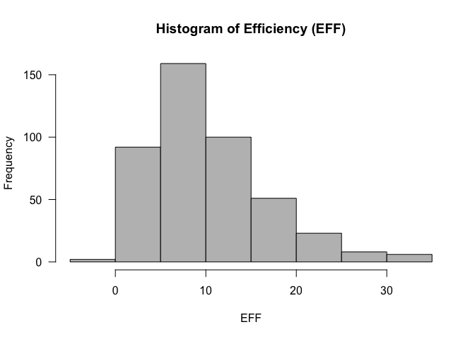
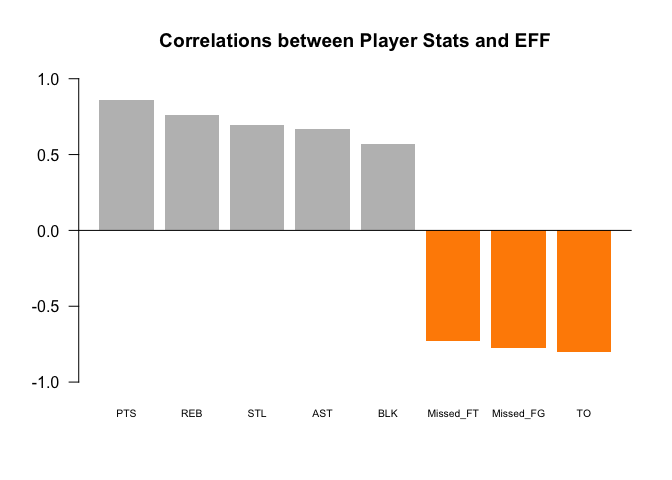
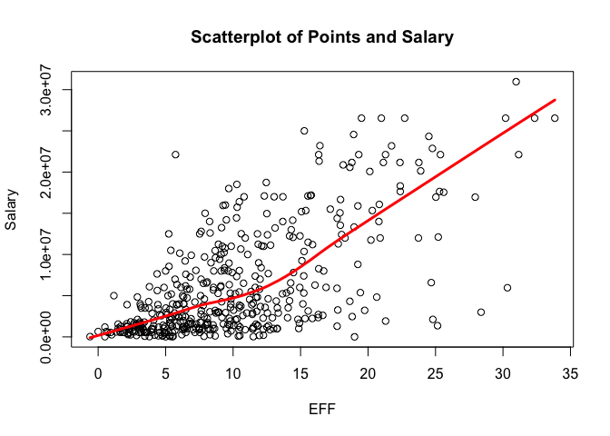
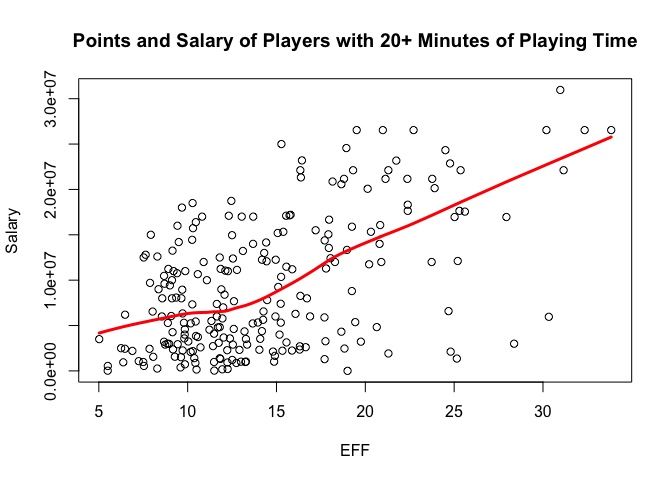

HW02 - Basics of Data Frames
================
Created by Hannah Kim

Research Question
-----------------

##### The more points a player scores, the higher his salary?

###### Goal: To expand the scope of the analysis by taking into account the overall performance of a player by looking at common individual statistics

### 1. Create a data dictionary

Purpose: To provide a comprehensive description of what the data is portraying about the individual NBA players

See file *'nba2017-player-statistics-dictionary.md'* for data dictionary

### 2. Importing Data

Purpose: To practice importing data tables in R

``` r
#importing data with read.csv() / importing style: base
dat1 <- read.csv('./data/nba2017-player-statistics.csv', colClasses = c("character", "character", "factor", "character", "double", rep("integer", 19)))
str(dat1)
```

    ## 'data.frame':    441 obs. of  24 variables:
    ##  $ Player      : chr  "Al Horford" "Amir Johnson" "Avery Bradley" "Demetrius Jackson" ...
    ##  $ Team        : chr  "BOS" "BOS" "BOS" "BOS" ...
    ##  $ Position    : Factor w/ 5 levels "C","PF","PG",..: 1 2 5 3 4 3 4 5 4 2 ...
    ##  $ Experience  : chr  "9" "11" "6" "R" ...
    ##  $ Salary      : num  26540100 12000000 8269663 1450000 1410598 ...
    ##  $ Rank        : int  4 6 5 15 11 1 3 13 8 10 ...
    ##  $ Age         : int  30 29 26 22 31 27 26 21 20 29 ...
    ##  $ GP          : int  68 80 55 5 47 76 72 29 78 78 ...
    ##  $ GS          : int  68 77 55 0 0 76 72 0 20 6 ...
    ##  $ MIN         : int  2193 1608 1835 17 538 2569 2335 220 1341 1232 ...
    ##  $ FGM         : int  379 213 359 3 95 682 333 25 192 114 ...
    ##  $ FGA         : int  801 370 775 4 232 1473 720 58 423 262 ...
    ##  $ Points3     : int  86 27 108 1 39 245 157 12 46 45 ...
    ##  $ Points3_atts: int  242 66 277 1 111 646 394 35 135 130 ...
    ##  $ Points2     : int  293 186 251 2 56 437 176 13 146 69 ...
    ##  $ Points2_atts: int  559 304 498 3 121 827 326 23 288 132 ...
    ##  $ FTM         : int  108 67 68 3 33 590 176 6 85 26 ...
    ##  $ FTA         : int  135 100 93 6 41 649 217 9 124 37 ...
    ##  $ OREB        : int  95 117 65 2 17 43 48 6 45 60 ...
    ##  $ DREB        : int  369 248 269 2 68 162 367 20 175 213 ...
    ##  $ AST         : int  337 140 121 3 33 449 155 4 64 71 ...
    ##  $ STL         : int  52 52 68 0 9 70 72 10 35 26 ...
    ##  $ BLK         : int  87 62 11 0 7 13 23 2 18 17 ...
    ##  $ TO          : int  116 77 88 0 25 210 79 4 68 39 ...

``` r
#importing data with read_csv() / importing style: readr
library(readr)
dat2 <- read_csv('./data/nba2017-player-statistics.csv', col_types = cols(Player = col_character(), Team = col_character(), Position = col_factor(c('C', 'PF', 'PG', 'SF', 'SG')), Experience = col_character(), Salary = col_double()))
str(dat2)
```

    ## Classes 'tbl_df', 'tbl' and 'data.frame':    441 obs. of  24 variables:
    ##  $ Player      : chr  "Al Horford" "Amir Johnson" "Avery Bradley" "Demetrius Jackson" ...
    ##  $ Team        : chr  "BOS" "BOS" "BOS" "BOS" ...
    ##  $ Position    : Factor w/ 5 levels "C","PF","PG",..: 1 2 5 3 4 3 4 5 4 2 ...
    ##  $ Experience  : chr  "9" "11" "6" "R" ...
    ##  $ Salary      : num  26540100 12000000 8269663 1450000 1410598 ...
    ##  $ Rank        : int  4 6 5 15 11 1 3 13 8 10 ...
    ##  $ Age         : int  30 29 26 22 31 27 26 21 20 29 ...
    ##  $ GP          : int  68 80 55 5 47 76 72 29 78 78 ...
    ##  $ GS          : int  68 77 55 0 0 76 72 0 20 6 ...
    ##  $ MIN         : int  2193 1608 1835 17 538 2569 2335 220 1341 1232 ...
    ##  $ FGM         : int  379 213 359 3 95 682 333 25 192 114 ...
    ##  $ FGA         : int  801 370 775 4 232 1473 720 58 423 262 ...
    ##  $ Points3     : int  86 27 108 1 39 245 157 12 46 45 ...
    ##  $ Points3_atts: int  242 66 277 1 111 646 394 35 135 130 ...
    ##  $ Points2     : int  293 186 251 2 56 437 176 13 146 69 ...
    ##  $ Points2_atts: int  559 304 498 3 121 827 326 23 288 132 ...
    ##  $ FTM         : int  108 67 68 3 33 590 176 6 85 26 ...
    ##  $ FTA         : int  135 100 93 6 41 649 217 9 124 37 ...
    ##  $ OREB        : int  95 117 65 2 17 43 48 6 45 60 ...
    ##  $ DREB        : int  369 248 269 2 68 162 367 20 175 213 ...
    ##  $ AST         : int  337 140 121 3 33 449 155 4 64 71 ...
    ##  $ STL         : int  52 52 68 0 9 70 72 10 35 26 ...
    ##  $ BLK         : int  87 62 11 0 7 13 23 2 18 17 ...
    ##  $ TO          : int  116 77 88 0 25 210 79 4 68 39 ...
    ##  - attr(*, "spec")=List of 2
    ##   ..$ cols   :List of 24
    ##   .. ..$ Player      : list()
    ##   .. .. ..- attr(*, "class")= chr  "collector_character" "collector"
    ##   .. ..$ Team        : list()
    ##   .. .. ..- attr(*, "class")= chr  "collector_character" "collector"
    ##   .. ..$ Position    :List of 3
    ##   .. .. ..$ levels    : chr  "C" "PF" "PG" "SF" ...
    ##   .. .. ..$ ordered   : logi FALSE
    ##   .. .. ..$ include_na: logi FALSE
    ##   .. .. ..- attr(*, "class")= chr  "collector_factor" "collector"
    ##   .. ..$ Experience  : list()
    ##   .. .. ..- attr(*, "class")= chr  "collector_character" "collector"
    ##   .. ..$ Salary      : list()
    ##   .. .. ..- attr(*, "class")= chr  "collector_double" "collector"
    ##   .. ..$ Rank        : list()
    ##   .. .. ..- attr(*, "class")= chr  "collector_integer" "collector"
    ##   .. ..$ Age         : list()
    ##   .. .. ..- attr(*, "class")= chr  "collector_integer" "collector"
    ##   .. ..$ GP          : list()
    ##   .. .. ..- attr(*, "class")= chr  "collector_integer" "collector"
    ##   .. ..$ GS          : list()
    ##   .. .. ..- attr(*, "class")= chr  "collector_integer" "collector"
    ##   .. ..$ MIN         : list()
    ##   .. .. ..- attr(*, "class")= chr  "collector_integer" "collector"
    ##   .. ..$ FGM         : list()
    ##   .. .. ..- attr(*, "class")= chr  "collector_integer" "collector"
    ##   .. ..$ FGA         : list()
    ##   .. .. ..- attr(*, "class")= chr  "collector_integer" "collector"
    ##   .. ..$ Points3     : list()
    ##   .. .. ..- attr(*, "class")= chr  "collector_integer" "collector"
    ##   .. ..$ Points3_atts: list()
    ##   .. .. ..- attr(*, "class")= chr  "collector_integer" "collector"
    ##   .. ..$ Points2     : list()
    ##   .. .. ..- attr(*, "class")= chr  "collector_integer" "collector"
    ##   .. ..$ Points2_atts: list()
    ##   .. .. ..- attr(*, "class")= chr  "collector_integer" "collector"
    ##   .. ..$ FTM         : list()
    ##   .. .. ..- attr(*, "class")= chr  "collector_integer" "collector"
    ##   .. ..$ FTA         : list()
    ##   .. .. ..- attr(*, "class")= chr  "collector_integer" "collector"
    ##   .. ..$ OREB        : list()
    ##   .. .. ..- attr(*, "class")= chr  "collector_integer" "collector"
    ##   .. ..$ DREB        : list()
    ##   .. .. ..- attr(*, "class")= chr  "collector_integer" "collector"
    ##   .. ..$ AST         : list()
    ##   .. .. ..- attr(*, "class")= chr  "collector_integer" "collector"
    ##   .. ..$ STL         : list()
    ##   .. .. ..- attr(*, "class")= chr  "collector_integer" "collector"
    ##   .. ..$ BLK         : list()
    ##   .. .. ..- attr(*, "class")= chr  "collector_integer" "collector"
    ##   .. ..$ TO          : list()
    ##   .. .. ..- attr(*, "class")= chr  "collector_integer" "collector"
    ##   ..$ default: list()
    ##   .. ..- attr(*, "class")= chr  "collector_guess" "collector"
    ##   ..- attr(*, "class")= chr "col_spec"

### 3. Right After Importing the Data

Purpose: To preprocess the 'Experience' column by replacing R with 0 and convert 'Experience' into integers

``` r
#replacing "R" with 0, then converting entire column into integers
ExperienceInt <- as.integer(replace(dat1$Experience, dat1$Experience == "R", "0"))
ExperienceInt
```

    ##   [1]  9 11  6  0  9  5  4  2  0  6  1  3  2  1  4 10 12 11  5  1  5 12 13
    ##  [24]  0  8 13  5 13 15  5  2  5  1  7  7  0  0  4 10  2  1  5  0  6  7  2
    ##  [47]  4  7  1  0  8  8  6  9  5  3  0  0  3  0  3 12  8 11  4 12  0 14  3
    ##  [70] 10  3 10  3  3  6  2 17  4  4  0  3  8  4  1  9  0  3  8 12 11  0  7
    ##  [93]  1  6  6  5 11  1  6  1  9  8  1  1  1  0 13  3  1  5  2  3  2  0 10
    ## [116]  8  4  8  4  7  9  1  1  6  0  0  2 13  7  1  4  4 12  1  1  0  6  5
    ## [139]  3  5  0  3  5  1  5  4  1  1  3  1  4  2  5  9 11  4  4  8  9  0 13
    ## [162]  0  8  7  9  3  1  4  5  0  0  0  0  9  0  2  5  9  8  2  2  4  8  7
    ## [185]  0  1  5  0  0  4  0  0  7  1  8  0  1  2  1  3  4  0  1  6  0  4  3
    ## [208]  8  0  0  6  2  2  2  4 10  1  2  2  6 12  0 13  4  3  2  8  9  1  5
    ## [231] 13  0 11  7 13  0  7 11  0  0  3  9  1  5  2 10 14  7 15 15  2  0  2
    ## [254]  8  0  7  0 11  1  4  8  1 12  0  7  4  6 11  0 11  8  0 10 16  8  8
    ## [277] 18 11  6  5 13  1  6  8  6  3  2 15  0  1  2  3  5  1  0  3  0  2  5
    ## [300]  2  1  4 12  5  8  0  3  7  3  0  8  5  0  2  2  1  8  9 12  3 18  0
    ## [323]  0 15  6  3  3  4  6  6  0  2  4  4  2  1  2  0  7  7  1  2  0 12  0
    ## [346]  5  0  3 16  1  8  4  8  6  4  1  0  7  6  4  5  4  7  6  0  3  2  0
    ## [369]  3 12 18  0  2  4 10  0  2  0  1  3  7  0  8  9  3  0  7  6  0  8  2
    ## [392]  0 10  0  7  7  1  2  2  8  6  3  7  1  0  1  7  5  3  1  2  0  9  1
    ## [415]  0  0  2  2  1 12 16  9  2  4  6  2  1  3  5  0  1  0  2  6  9 13  0
    ## [438] 11  2  0 15

### 4. Performance of Players

Purpose: To consider basic individual statistics commonly used in the NBA in order to get a proxy of a player’s performance by computing the EFF (Efficiency statistic)

``` r
#computing PTS, REB, Missed FG, Missed FT (parts of the EFF equation that are not already in the NBA 2017 data)
PTS = ((dat1$FGM - dat1$Points2 - dat1$Points3) + dat1$FTM) + 2*dat1$Points2 + 3*dat1$Points3
REB = dat1$OREB + dat1$DREB
Missed_FG = dat1$FGA - dat1$FGM
Missed_FT = dat1$FTA - dat1$FTM

#adding EFF to the data frame
dat1$EFF = c((PTS + REB + dat1$AST + dat1$STL + dat1$BLK - Missed_FG - Missed_FT - dat1$TO) / dat1$GP)

summary(dat1$EFF)
```

    ##    Min. 1st Qu.  Median    Mean 3rd Qu.    Max. 
    ##  -0.600   5.452   9.090  10.137  13.247  33.840

``` r
#histogram of efficiency statistics
hist(x = dat1$EFF, main = "Histogram of Efficiency (EFF)", xlab = "EFF", ylab = "Frequency", col = "grey", las = 1)
```



``` r
library(dplyr)
```

    ## Warning: package 'dplyr' was built under R version 3.4.2

    ## 
    ## Attaching package: 'dplyr'

    ## The following objects are masked from 'package:stats':
    ## 
    ##     filter, lag

    ## The following objects are masked from 'package:base':
    ## 
    ##     intersect, setdiff, setequal, union

``` r
#player name, team, salary, and EFF value of the top-10 players by EFF in decreasing order
select(slice(arrange(dat1, desc(EFF)), 1:10), Player, Team, Salary, EFF)
```

    ## # A tibble: 10 x 4
    ##                   Player  Team   Salary      EFF
    ##                    <chr> <chr>    <dbl>    <dbl>
    ##  1     Russell Westbrook   OKC 26540100 33.83951
    ##  2          James Harden   HOU 26540100 32.34568
    ##  3         Anthony Davis   NOP 22116750 31.16000
    ##  4          LeBron James   CLE 30963450 30.97297
    ##  5    Karl-Anthony Towns   MIN  5960160 30.32927
    ##  6          Kevin Durant   GSW 26540100 30.19355
    ##  7 Giannis Antetokounmpo   MIL  2995421 28.37500
    ##  8      DeMarcus Cousins   NOP 16957900 27.94118
    ##  9          Jimmy Butler   CHI 17552209 25.60526
    ## 10      Hassan Whiteside   MIA 22116750 25.36364

``` r
#name(s) of the player(s) that have a negative EFF
select(filter(dat1, EFF < 0), Player, EFF)
```

    ##            Player  EFF
    ## 1 Patricio Garino -0.6

``` r
#correlation coefficients between EFF and all the variables used in the EFF formula
corPTS = cor(PTS, dat1$EFF)
corREB = cor(REB, dat1$EFF)
corAST = cor(dat1$AST, dat1$EFF)
corSTL = cor(dat1$STL, dat1$EFF)
corBLK = cor(dat1$BLK, dat1$EFF)
corMFG = cor(-Missed_FG, dat1$EFF)
corMFT = cor(-Missed_FT, dat1$EFF)
corTO = cor(-dat1$TO, dat1$EFF)

#computed correlations in descending order in vector form
barplot_cor <- (c(PTS = corPTS, REB = corREB, STL = corSTL, AST = corAST, BLK = corBLK, Missed_FT = corMFT, Missed_FG = corMFG, TO = corTO))
barplot_cor
```

    ##        PTS        REB        STL        AST        BLK  Missed_FT 
    ##  0.8588644  0.7634501  0.6957286  0.6689232  0.5679571 -0.7271456 
    ##  Missed_FG         TO 
    ## -0.7722477 -0.8003289

``` r
#barchart with the correlations (bars in decreasing order)
pos = barplot_cor >= 0
cols = c("dark orange", "grey")
barplot(sort(barplot_cor, decreasing = TRUE), ylim = c(-1, 1), cex.names = 0.65, main = "Correlations between Player Stats and EFF", las = 1, col = cols[pos + 1], border = NA)
abline(h = 0)
```



### 5. Efficiency and Salary

Purpose: To produce a scatterplot between Efficiency (x-axis) and Salary (y-axis), including a *loess* smooth line (locally weighted scatterplot smoothing)

#### Comparing EFF and Salaries Amongst ALL Players

``` r
#scatterplot between EFF and salary with loess smooth line
plot(dat1$EFF, dat1$Salary, col = "black", xlab = "EFF", ylab = "Salary", main = "Scatterplot of Points and Salary", pch = 21, cex = 1)
lines(lowess(dat1$EFF, dat1$Salary), col="RED", lwd = 3)
```



``` r
#correlation coefficient between EFF and salary
corSalary = cor(dat1$EFF, dat1$Salary)
corSalary
```

    ## [1] 0.655624

> The Scatterplot of Points and Salary has a positive correlation overall with most of the data points cluttered between 0 and 10 EFF and 0 to 7 million salary. The data trends aren't equal across the graphs, which indicates that there is a significant greater number of players who have a lower EFF statistic (performance), resulting in lower salaries for the most part. Those with a higher EFF statistics seem to earn more on average.

#### Comparing EFF and Salaries Amongst Players with 20+ Minutes Playing Time

``` r
#players who played more than 20 minutes per game
library(dplyr)
MPG = dat1$MIN/dat1$GP
select(filter(dat1, MPG >= 20), Player)
```

    ##                       Player
    ## 1                 Al Horford
    ## 2               Amir Johnson
    ## 3              Avery Bradley
    ## 4              Isaiah Thomas
    ## 5                Jae Crowder
    ## 6               Kelly Olynyk
    ## 7               Marcus Smart
    ## 8             Deron Williams
    ## 9                Edy Tavares
    ## 10             Iman Shumpert
    ## 11                J.R. Smith
    ## 12                Kevin Love
    ## 13               Kyle Korver
    ## 14              Kyrie Irving
    ## 15              LeBron James
    ## 16         Richard Jefferson
    ## 17          Tristan Thompson
    ## 18               Cory Joseph
    ## 19             DeMar DeRozan
    ## 20           DeMarre Carroll
    ## 21         Jonas Valanciunas
    ## 22                Kyle Lowry
    ## 23               P.J. Tucker
    ## 24         Patrick Patterson
    ## 25               Serge Ibaka
    ## 26          Bojan Bogdanovic
    ## 27              Bradley Beal
    ## 28                 John Wall
    ## 29             Marcin Gortat
    ## 30           Markieff Morris
    ## 31               Otto Porter
    ## 32           Dennis Schroder
    ## 33             Dwight Howard
    ## 34            Ersan Ilyasova
    ## 35             Kent Bazemore
    ## 36              Paul Millsap
    ## 37           Thabo Sefolosha
    ## 38              Tim Hardaway
    ## 39     Giannis Antetokounmpo
    ## 40               Greg Monroe
    ## 41             Jabari Parker
    ## 42           Khris Middleton
    ## 43           Malcolm Brogdon
    ## 44       Matthew Dellavedova
    ## 45                Tony Snell
    ## 46                C.J. Miles
    ## 47               Jeff Teague
    ## 48          Lance Stephenson
    ## 49               Monta Ellis
    ## 50              Myles Turner
    ## 51               Paul George
    ## 52            Thaddeus Young
    ## 53               Dwyane Wade
    ## 54              Jimmy Butler
    ## 55            Nikola Mirotic
    ## 56               Rajon Rondo
    ## 57               Robin Lopez
    ## 58              Dion Waiters
    ## 59              Goran Dragic
    ## 60          Hassan Whiteside
    ## 61             James Johnson
    ## 62           Josh Richardson
    ## 63           Justise Winslow
    ## 64           Rodney McGruder
    ## 65             Tyler Johnson
    ## 66           Wayne Ellington
    ## 67            Andre Drummond
    ## 68                 Ish Smith
    ## 69                 Jon Leuer
    ## 70  Kentavious Caldwell-Pope
    ## 71             Marcus Morris
    ## 72            Reggie Jackson
    ## 73             Tobias Harris
    ## 74               Cody Zeller
    ## 75            Frank Kaminsky
    ## 76              Kemba Walker
    ## 77           Marco Belinelli
    ## 78           Marvin Williams
    ## 79    Michael Kidd-Gilchrist
    ## 80             Nicolas Batum
    ## 81           Carmelo Anthony
    ## 82              Courtney Lee
    ## 83              Derrick Rose
    ## 84               Joakim Noah
    ## 85        Kristaps Porzingis
    ## 86              Lance Thomas
    ## 87              Aaron Gordon
    ## 88           Bismack Biyombo
    ## 89             Elfrid Payton
    ## 90             Evan Fournier
    ## 91                Jeff Green
    ## 92               Jodie Meeks
    ## 93            Nikola Vucevic
    ## 94             Terrence Ross
    ## 95            Alex Poythress
    ## 96               Dario Saric
    ## 97          Gerald Henderson
    ## 98             Jahlil Okafor
    ## 99            Jerryd Bayless
    ## 100              Joel Embiid
    ## 101          Justin Anderson
    ## 102             Nik Stauskas
    ## 103           Richaun Holmes
    ## 104         Robert Covington
    ## 105         Sergio Rodriguez
    ## 106           T.J. McConnell
    ## 107              Brook Lopez
    ## 108             Caris LeVert
    ## 109         Isaiah Whitehead
    ## 110               Jeremy Lin
    ## 111               Joe Harris
    ## 112  Rondae Hollis-Jefferson
    ## 113          Sean Kilpatrick
    ## 114        Spencer Dinwiddie
    ## 115            Trevor Booker
    ## 116           Andre Iguodala
    ## 117           Draymond Green
    ## 118             Kevin Durant
    ## 119            Klay Thompson
    ## 120              Matt Barnes
    ## 121            Stephen Curry
    ## 122              Danny Green
    ## 123            Kawhi Leonard
    ## 124        LaMarcus Aldridge
    ## 125              Patty Mills
    ## 126                Pau Gasol
    ## 127              Tony Parker
    ## 128             Clint Capela
    ## 129              Eric Gordon
    ## 130             James Harden
    ## 131             Lou Williams
    ## 132         Patrick Beverley
    ## 133            Ryan Anderson
    ## 134             Trevor Ariza
    ## 135            Troy Williams
    ## 136            Austin Rivers
    ## 137            Blake Griffin
    ## 138               Chris Paul
    ## 139           DeAndre Jordan
    ## 140              J.J. Redick
    ## 141           Jamal Crawford
    ## 142         Luc Mbah a Moute
    ## 143           Raymond Felton
    ## 144           Derrick Favors
    ## 145              George Hill
    ## 146           Gordon Hayward
    ## 147               Joe Ingles
    ## 148              Joe Johnson
    ## 149              Rodney Hood
    ## 150              Rudy Gobert
    ## 151             Shelvin Mack
    ## 152           Andre Roberson
    ## 153         Domantas Sabonis
    ## 154              Enes Kanter
    ## 155        Russell Westbrook
    ## 156             Steven Adams
    ## 157               Taj Gibson
    ## 158           Victor Oladipo
    ## 159          Andrew Harrison
    ## 160              James Ennis
    ## 161           JaMychal Green
    ## 162               Marc Gasol
    ## 163              Mike Conley
    ## 164               Tony Allen
    ## 165             Vince Carter
    ## 166            Zach Randolph
    ## 167          Al-Farouq Aminu
    ## 168             Allen Crabbe
    ## 169            C.J. McCollum
    ## 170           Damian Lillard
    ## 171              Evan Turner
    ## 172             Jusuf Nurkic
    ## 173         Maurice Harkless
    ## 174         Danilo Gallinari
    ## 175          Emmanuel Mudiay
    ## 176              Gary Harris
    ## 177             Jamal Murray
    ## 178            Jameer Nelson
    ## 179           Kenneth Faried
    ## 180            Mason Plumlee
    ## 181             Nikola Jokic
    ## 182              Will Barton
    ## 183          Wilson Chandler
    ## 184            Anthony Davis
    ## 185             Axel Toupane
    ## 186         Dante Cunningham
    ## 187         DeMarcus Cousins
    ## 188            E'Twaun Moore
    ## 189          Jordan Crawford
    ## 190             Jrue Holiday
    ## 191             Solomon Hill
    ## 192              Tim Frazier
    ## 193          DeAndre Liggins
    ## 194            Dirk Nowitzki
    ## 195      Dorian Finney-Smith
    ## 196          Harrison Barnes
    ## 197               J.J. Barea
    ## 198             Nerlens Noel
    ## 199               Seth Curry
    ## 200          Wesley Matthews
    ## 201             Yogi Ferrell
    ## 202         Anthony Tolliver
    ## 203            Arron Afflalo
    ## 204              Buddy Hield
    ## 205          Darren Collison
    ## 206           Garrett Temple
    ## 207                 Rudy Gay
    ## 208                Ty Lawson
    ## 209             Tyreke Evans
    ## 210           Andrew Wiggins
    ## 211             Brandon Rush
    ## 212             Gorgui Dieng
    ## 213       Karl-Anthony Towns
    ## 214              Ricky Rubio
    ## 215              Zach LaVine
    ## 216           Brandon Ingram
    ## 217         D'Angelo Russell
    ## 218          Jordan Clarkson
    ## 219            Julius Randle
    ## 220          Larry Nance Jr.
    ## 221                Luol Deng
    ## 222               Nick Young
    ## 223           Timofey Mozgov
    ## 224                 Alex Len
    ## 225           Brandon Knight
    ## 226             Devin Booker
    ## 227             Eric Bledsoe
    ## 228             Jared Dudley
    ## 229          Marquese Chriss
    ## 230              T.J. Warren
    ## 231           Tyson Chandler

``` r
#data frame 'players2' with players who played more than 20 minutes per game
players2 <- data.frame(select(filter(dat1, MPG >= 20), Player, EFF, Salary))

#scatterplot between Efficiency and Salary, including a lowess smooth line for 'players2' data frame
plot(players2$EFF, players2$Salary, col = "black", xlab = "EFF", ylab = "Salary", main = "Points and Salary of Players with 20+ Minutes of Playing Time", pch = 21, cex = 1)
lines(lowess(players2$EFF, players2$Salary), col = "RED", lwd = 3)
```



``` r
#linear correlation coefficient between EFF and Salary for 'players2'
cor(players2$EFF, players2$Salary)
```

    ## [1] 0.5367224

> The scatterplot showing only players with more than 20 minutes of playing time is different from the scatterplot comparing across all players because the data points are more spread out for the second graph. Although there are still a greater number of points near the 5-15 EFF range, the points are a lot more spread out compared to the first scatterplot. The loess line is also less steep, which indicates that the span for the data points are less varied.

### 6. Comments and Reflections

1.  **What things were hard, even though you saw them in class/lab?** It took me a while to figure out how to implement the 'players2' data frame and graph points only from players2 because I'm still practicing importing data from an already existing data frame.

2.  **What was easy(-ish) even though we haven’t done it in class/lab?** In the previous homework, we had to manually compute the correlation coefficients ourselves, so it was easier for this homework when we could simply use the cor() function to compute the correlation coefficients for the statistics that make up EFF.

3.  **Did you need help to complete the assignment? If so, what kind of help?** I needed help with colClasses and col\_types, which I read up on the two resources given to us on the work. I also wanted to make my graphs aesthetically pleasing, so I had to do a Google search to learn how to change the colors for different bars of the graph.

4.  **How much time did it take to complete this HW?** It took me approximately 7 hours.

5.  **What was the most time consuming part?** The most time consuming part was when I had to compute the EFF by creating PTS, REB, Missed\_FG, and Missed\_FT. I didn't consider the weights of the points at first, so I was having different summary statistics, but I figured out that I had to consider the 2 pointers and 3 pointers since my original code read everything as 1 pointers.

6.  **Was there anything that you did not understand? or fully grasped?** I am still not 100% sure why my scatterplot for players2 data does not work if my 'players2' data frame code does not include 'Player, EFF, Salary' at the end. For instance, if I do 'players2 &lt;- data.frame(select(filter(dat1, MPG &gt;= 20)))' the scatterplot does not work, but if I keep my code as 'players2 &lt;- data.frame(select(filter(dat1, MPG &gt;= 20), Player, EFF, Salary))' then it works. I'm still trying to fully grasp why that is the case.

7.  **Was there anything frustrating in particular?** There wasn't anything extremely frustrating in particular because my outputs eventually seemed to align with expectations in the end.

8.  **Was there anything exciting? Something that you feel proud of? (Don’t be shy, we won’t tell anyone).** I am proud of my barchart with correlations because I think it aesthetically looks nice! I'm also proud of correctly computing the EFF statistics, generating the correct summary statistics.
