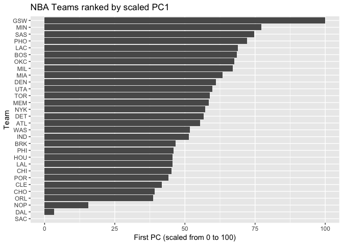

HW03 Ranking NBA Teams
================
Hannah Kim

##### If you had to come up with a ranking system for the teams, how would you rank them?

### Ranking of Teams

##### Basic Rankings

``` r
teams = read.csv(file = '../data/nba2017-teams.csv', stringsAsFactors = FALSE)

library(dplyr)
```

    ## Warning: package 'dplyr' was built under R version 3.4.2

    ## 
    ## Attaching package: 'dplyr'

    ## The following objects are masked from 'package:stats':
    ## 
    ##     filter, lag

    ## The following objects are masked from 'package:base':
    ## 
    ##     intersect, setdiff, setequal, union

``` r
library(ggplot2)

#bar chart of teams ranked by total salaries
ggplot(teams, aes(x = reorder(team, salary), y = salary)) +
  geom_bar(stat = 'identity') +
  coord_flip() +
  ggtitle("NBA Teams ranked by Total Salary") +
  labs(x = "Team", y = "Salary (in millions)") +
  geom_abline(aes(intercept = mean(salary), slope = 0, col = "red"), size = 2, alpha = 0.8)
```


The average team salary seems to be at about 90 million dollars, and players in the Cleveland Cavaliers (CLE) seem to have the highest salaries and the Philadelphia 76ers (PHI) have the lowest salaries on average. CLE seem to be pulling the salary averages.

``` r
#bar chart of teams ranked by total points
ggplot(teams, aes(x = reorder(team, points), y = points)) +
  geom_bar(stat = 'identity') +
  coord_flip() +
  ggtitle("NBA Teams ranked by Total Points") +
  labs(x = "Team", y = "Total Points") +
  geom_abline(aes(intercept = mean(points), slope = 0, col = "red"), size = 2, alpha = 0.8)
```


The average team points seem to be at approximately 8,125 points, with the Golden State Warriors (GSW) scoring the most points on average (max) and the Sacramento Kings (SAC) scoring the least points on average (min). Scores on average are very high across teams who scored near the average and above.

``` r
#bar chart of teams ranked by total efficiency
ggplot(teams, aes(x = reorder(team, efficiency), y = efficiency)) +
  geom_bar(stat = 'identity') +
  coord_flip() +
  ggtitle("NBA Teams ranked by Total Efficiency") +
  labs(x = "Team", y = "Total Efficiency") +
  geom_abline(aes(intercept = mean(efficiency), slope = 0, col = "red"), size = 2, alpha = 0.8)
```


The average efficiency statistics across all teams is at around 150, with the Cleveland Cavaliers (CLE) obtaining the highest efficiency statistics. From the three graphs, it seems CLE has the highest team salaries on average and highest efficiency statistic. Orlando Magic (ORL) have the lowest efficiency statistic.

### Principal Components Analysis (PCA)

``` r
variables <- teams[ ,c("points3", "points2", "free_throws", "off_rebounds", "def_rebounds", 
                "assists", "steals", "blocks", "turnovers", "fouls")]

#creating data frame with eigenvalues
pca <- prcomp(variables, scale. = TRUE)
eigvalues <- data.frame(eigenvalue = round(pca$sdev^2,4), prop = round(pca$sdev^2 /sum(pca$sdev^2), 4))
eigvalues$cumprop = round(cumsum(eigvalues$prop),4)
eigvalues
```

    ##    eigenvalue   prop cumprop
    ## 1      4.6959 0.4696  0.4696
    ## 2      1.7020 0.1702  0.6398
    ## 3      0.9795 0.0980  0.7378
    ## 4      0.7717 0.0772  0.8150
    ## 5      0.5341 0.0534  0.8684
    ## 6      0.4780 0.0478  0.9162
    ## 7      0.3822 0.0382  0.9544
    ## 8      0.2603 0.0260  0.9804
    ## 9      0.1336 0.0134  0.9938
    ## 10     0.0627 0.0063  1.0001

``` r
#using first two PCs to get a scatterplot of the teams
rot <- data.frame(team = teams$team, PC1 = pca$x[ ,"PC1"], PC2 = pca$x[ ,"PC2"])
ggplot(data = rot, aes(x = PC1, y = PC2)) +
  geom_text(aes(label = team)) +
  ggtitle("PCA plot (PC1 and PC2") + 
  geom_hline(yintercept = 0) +
  geom_vline(xintercept = 0)
```


``` r
#interpret PCs by looking at associated weights
pca$rotation[ ,1:2]
```

    ##                    PC1         PC2
    ## points3      0.1121782 -0.65652993
    ## points2      0.3601766  0.32892544
    ## free_throws  0.3227564 -0.17651228
    ## off_rebounds 0.3029366  0.35931603
    ## def_rebounds 0.3719432 -0.12808273
    ## assists      0.3125312 -0.44134618
    ## steals       0.3447256 -0.03540585
    ## blocks       0.3162237  0.06131890
    ## turnovers    0.3353958 -0.02169833
    ## fouls        0.3072548  0.28954426

PC1 seems more relevant to the data because a lot of the teams are clustered in the positive quadrant while PC2 is mostly negative. PC1 projects a more positive correlation than PC2.

##### Index based on PC1

``` r
#scale first PC with new scale ranging 0 to 100
z1 = pca$x[ ,"PC1"]
s1 = 100 * (z1 - min(z1))/(max(z1) - min(z1))
teams$s1 = s1

#bar chart with rescaled PC1
ggplot(teams, aes(x = reorder(team, s1), y = s1)) +
  geom_bar(stat = 'identity') +
  coord_flip() +
  ggtitle("NBA Teams ranked by scaled PC1") +
  labs(x = "Team", y = "First PC (scaled from 0 to 100)") 
```



Based on the PC1 index, the Golden State Warriors (GSW) are significantly ahead of the other teams by a big margin and the Sacramento Kings (SAC) have the absolute lowest. GSW and SAC seem to be the two extremes. There is a steady increase in the PC1 index from Orlando Magic (ORL) and until the Minnesota Timberwolves (MIN).

### Comments and Reflections

1.  **Was this your first time working on a project with such file structure? If yes, how do you feel about it?** Yes, this is my first time working on a project with this file structure. I personally I thought it was a good structure because it keeps my files organized, and I feel as if it'd be easier for me to reference back to projects/assignments.

2.  **Was this your first time using relative paths? If yes, can you tell why they are important for reproducibility purposes?** Besides from learning relative paths in previous lectures and labs, this is my first time using relative paths on homework. Relative paths are definitely beneficial for reproducibility purposes than absolute paths because for relative paths you are traveling relative to your current position.

3.  **Was this your first time using an R script? If yes, what do you think about just writing code?** Besides being introduced to R script in the way beginning of the course, this is my first time using R script on a homework assignment. I don't mind using R script than R markdown because I can still see my outputs in the console.

4.  **What things were hard, even though you saw them in class/lab?** The PCA calculation was a lot more complicated than I had anticipated even though we covered it during class. I was lost for the majority of time when we were learning PCA in class, so it took a while to understand the concept in the first place.

5.  **What was easy(-ish) even though we haven’t done it in class/lab?** I feel as if most of the parts that I found easy were either covered during class or lab.

6.  **Did anyone help you completing the assignment? If so, who?** My help has come from doing an intensive Google search, and reviewing lecture slides in detail and using additional resources on the web to understand PCA.

7.  **How much time did it take to complete this HW?** This homeowrk took me approximately 8 hours.

8.  **What was the most time consuming part?** The most time consuming part was completing the PCA and creating the data frame with eigenvalues.

9.  **Was there anything interesting?** Seeing the various barplots be generated was interesting. Seeing how the extreme points stood out more after performing the scaled PC1 index was interesting to see as well.
