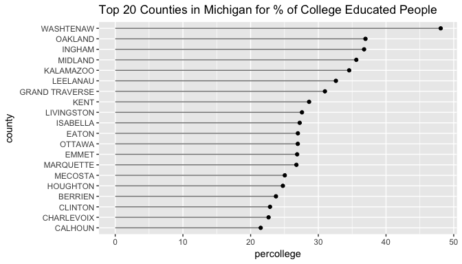
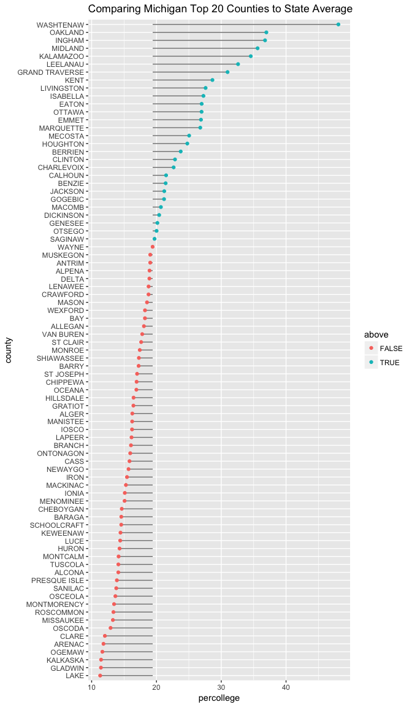
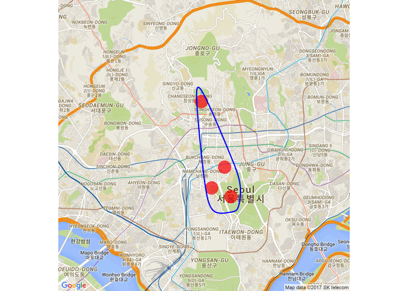
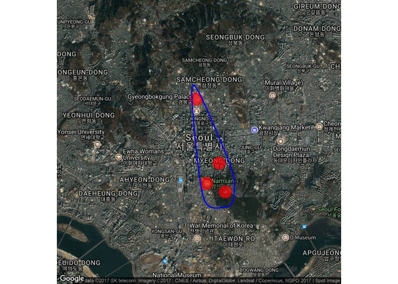

Why use the ggplot2 package? Appealing, Convenient, and Applicable!
================
Hannah Kim
October 28, 2017

``` r
# loading fundamental packages
library(ggplot2)
library(dplyr)
library(readr)
```

Introduction & Motivation
-------------------------

A single logo or color on an infographic or data visualization instantly draws our attention to a specific data point. Although not a necessity, colors and aesthetics are a bonus when it comes to visualizing data and conveying a message in your data analysis. For instance, let's say you wanted to create a report and analyze the outcomes of the US presidential elections. It is graphically appealing to look at graphs with clear labels of red and blue, depicting the two parties, rather than looking at black and white graphs with no distinct characteristics.

Certainly, graphs could be generated using base R plotting with `plot()`, `hist()`, `boxplot()`, etc., but the graphs do not convey a visually compelling story. However, the R package `ggplot2` is more convenient to use than base plotting because it produces *automated* legends, colors, and faceting. As someone who is an advocate of graphically appealing data visualizations that convey a meaningful message, `ggplot2` is a great package for data analysts to utilize.

In class, using `ggplot2`, we have predominantly explored how to generate scatterplots (with loess lines), bar graphs, and line graphs. Therefore, the purpose of this post will serve as an extension to what we learned in class. We will explore new `geom` functions, and learn how to generate graphs we have not covered in class, such as heat maps, using interesting data sets. Ultimately, we will look into ggplot graphs that are useful in real-life applications.

The following image is an example of a graph generated using the `ggplot2` package:

``` r
# an example of a bar graph made using ggplot2 package
knitr::include_graphics("https://plot.ly/~RPlotBot/4026/migration-to-the-united-states-by-source-region-1820-2006-in-millions.png")
```


Background
----------

The `ggplot2` package was created by Hadley Wickham in 2005 and is an application of Leland Wilkinson's *Grammar of Graphics*. According to Wickham, `ggplot2` "provides beautiful, hassle-free plots, that take care of fiddly details like drawing legends" and "is designed to work in a layered fashion, starting with a layer showing the raw data then adding layers of annotations and statistical summaries" \[1\]. Since 2005, `ggplot2` has grown to be one of the most popular packages in R. Over the years, numerous changes have been made to improve `ggplot2`. On March 2nd, 2012, "ggplot2 version 0.9.0 was released with numerous changes to internal organization, scale construction and layers" \[2\]. `ggplot2` package is currently in the maintenance stage, so it will continue to enhance its existing features, but not necessarily develop new ones.


Examples
--------

### 1. Heatmap Plotting

**Heat maps** are graphical representations of data where individual values contained in the matrix are represented as colors. Heat maps are useful in real-life applications because it provides an immediate visual summary of the data, making it more convenient for stakeholder consumption \[3\]. The forest fires data set focuses on forest fires that occurred in Montesinho Park in Portugal. The following code walks through how to generate a heat map using `ggplot2`. To plot this graph, I received guidance from [this source](https://flowingdata.com/2010/01/21/how-to-make-a-heatmap-a-quick-and-easy-solution/) \[4\].

The following image is an example of a heat map: 

We will use the [Forest Fires data set](http://archive.ics.uci.edu/ml/datasets/Forest+Fires) \[5\] from UCI's Machine Learning repository.

Here are the following column labels of the data set:

> <font size = "2"> 1. X: x-axis spatial coordinate within the Montesinho park map: 1 to 9 <br> 2. Y: y-axis spatial coordinate within the Montesinho park map: 2 to 9 <br> 3. month: month of the year: 'jan' to 'dec' <br> 4. day: day of the week: 'mon' to 'sun' <br> 5. FFMC: Fine Fuel Moisture Code index from the Forest Fire Weather Index (FWI) system: 18.7 to 96.20 <br> 6. DMC: Duff Moisture Code index from the FWI system: 1.1 to 291.3 <br> 7. DC: Drought Code index from the FWI system: 7.9 to 860.6 <br> 8. ISI: Initial Spread Index from the FWI system: 0.0 to 56.10 <br> 9. temp: temperature in Celsius degrees: 2.2 to 33.30 <br> 10. RH: relative humidity in %: 15.0 to 100 <br> 11. wind: wind speed in km/h: 0.40 to 9.40 <br> 12. rain: outside rain in mm/m2 : 0.0 to 6.4 <br> 13. area: the burned area of the forest (in ha): 0.00 to 1090.84 </font>

Term clarifications:

-   *Fine Fuel Moisture Code (FFMC)*: Litter layer, and other cured fine fuels; Plays a significant role in ignition probability and spread

-   *Duff Moisture Code (DMC)*: Loosely compacted, fermenting (decomposing) organic matter; Contributes to lightning receptivity and over all fire intensity

-   *Drought Code (DC)*: Deep layer of compact humus (decomposed) organic matter; Contributes to depth of burn, intensity, and suppression difficulty

-   *Initial Spread Index (ISI)*: Combines FFMC and wind speed; Varies greatly based on current wind conditions \[6\]

Once we load our data set, we removed irrelevant columns such as `rain`, `area`, `X`, and `Y`. The values for `rain` and `area` are mostly zero, and also do not describe the conditions of the fire, so we would like to take them out of the data set. The spatial coordinates, `X` and `Y`, also do not describe the fire, so we omit those as well.

``` r
# loading the forest fires data set and reading csv file
forestfires <- read_csv("data/forestfires.csv")
```

    ## Parsed with column specification:
    ## cols(
    ##   X = col_integer(),
    ##   Y = col_integer(),
    ##   month = col_character(),
    ##   day = col_character(),
    ##   FFMC = col_double(),
    ##   DMC = col_double(),
    ##   DC = col_double(),
    ##   ISI = col_double(),
    ##   temp = col_double(),
    ##   RH = col_integer(),
    ##   wind = col_double(),
    ##   rain = col_double(),
    ##   area = col_double()
    ## )

``` r
# took out irrelevant columns using select()
forestfires <- forestfires %>% select(-rain, -area, -X, -Y)
```

Forest fires are ordered by temperature in Celcius, and the month variable converted to a factor that ensures proper sorting of the plot. The forest fire statistics have different ranges, so we scale the individual statistics to make them comparable.

``` r
# loading packages needed for scaling
library(plyr)
library(reshape2)

# sorting data by month
forestfires$day <- with(forestfires, reorder(month, temp))

# individual statistics are scaled so that they are displayed nicely on heatmap
forestfires.m <- melt(forestfires)

forestfires.s <- ddply(forestfires.m, .(variable), transform, rescale = sqrt(value))
last_plot() %+% forestfires.s
```

To create the heatmap plot, we combined `geom_tile()` with a smooth gradient fill. You can see that the legend is a rescaled version of the values in the data set. Because the values vary in size, the legend is simply a square rooted version of the values of the data.

``` r
# create heatmap using ggplot2
ggplot(forestfires.s, aes(variable, month)) + geom_tile(aes(fill = rescale), 
            color = "white") + ggtitle("Forest Fire Characteristics in Montesinho Park") + scale_fill_gradient2(low = "black", high = "red")
```


### 2. Exploring `geom_jitter()`

**Jittering** is particularly useful for small datasets with at least one discrete position. `geom_jitter()` "adds a small amount of random variation to the location of each point, and is a useful way of handling overplotting caused by discreteness in smaller datasets" \[7\].

We use the same forest fires data set in this example.

Since our forest fire data set isn't large, the `geom_jitter()` function also shows a nice depiction of the different temperatures of the fires during the different months of the year.

``` r
# creating a jitter geom with the same forest fire data set
ggplot(forestfires, aes(month, temp)) + ggtitle("Forest Fire Temperature (by Month)") +
  geom_jitter()
```


### 3. Lollipop Charts

A **lollipop chart** is a hybrid between a bar chart and a Cleveland dot plot. For visualization purposes, assuming that most of you know what a bar chart is, the image below is an example of a Cleveland dot plot. "A lollipop chart typically contains categorical variables on the y-axis measured against a second (continuous) variable on the x-axis" \[8\]. The purpose of the dot is to draw the viewer's attention towards the corresponding category, and the purpose of the line is to be as minimalistic as possible, not drawing much attention to the viewer. A lollipop chart is applicable because it is a great chart to use to compare multiple categories. For the sake of demonstration, most of the code for lollipop charts are inspired by [this source](http://uc-r.github.io/lollipop).


The `midwest` data set is already provided in the `ggplot2` package, so we could use `head(midwest)` to look at the first few rows of the data set. Let's say we want to view the top 20 counties in Michigan for percentage of educated people.

`percollege`: counties are ordered by percent college educated

`county`: factor with multiple levels

``` r
# see first few rows of data
head(midwest)
```

    ## # A tibble: 6 x 28
    ##     PID    county state  area poptotal popdensity popwhite popblack
    ##   <int>     <chr> <chr> <dbl>    <int>      <dbl>    <int>    <int>
    ## 1   561     ADAMS    IL 0.052    66090  1270.9615    63917     1702
    ## 2   562 ALEXANDER    IL 0.014    10626   759.0000     7054     3496
    ## 3   563      BOND    IL 0.022    14991   681.4091    14477      429
    ## 4   564     BOONE    IL 0.017    30806  1812.1176    29344      127
    ## 5   565     BROWN    IL 0.018     5836   324.2222     5264      547
    ## 6   566    BUREAU    IL 0.050    35688   713.7600    35157       50
    ## # ... with 20 more variables: popamerindian <int>, popasian <int>,
    ## #   popother <int>, percwhite <dbl>, percblack <dbl>, percamerindan <dbl>,
    ## #   percasian <dbl>, percother <dbl>, popadults <int>, perchsd <dbl>,
    ## #   percollege <dbl>, percprof <dbl>, poppovertyknown <int>,
    ## #   percpovertyknown <dbl>, percbelowpoverty <dbl>,
    ## #   percchildbelowpovert <dbl>, percadultpoverty <dbl>,
    ## #   percelderlypoverty <dbl>, inmetro <int>, category <chr>

``` r
# perform data manipulation and select the top 20 counties in Michigan percollege
michigan_top20 <- midwest %>%
        filter(state == "MI") %>%
        select(county, percollege) %>%
        arrange(desc(percollege)) %>%
        top_n(20) %>%
        arrange(percollege) %>%
        mutate(county = factor(county, levels = .$county))
```

    ## Selecting by percollege

`geom_segment` is used to plot the lines and then we have to make it so that the lines start at `x = 0`. We use `xend = percollege` to clarify that we want the values to be extended with lines. The same goes for `y = county` and `yend = county`.

``` r
# create ggplot for top 20 counties in Michigan
ggplot(michigan_top20, aes(percollege, county)) +
        ggtitle("Top 20 Counties in Michigan for % of College Educated People") +
        geom_segment(aes(x = 0, y = county, xend = percollege, yend = county), color = "grey50") +
        geom_point()
```



Now we will use lollipop charts to compare multiple variables. We will compare counties in Michigan to the state average in order to observe the discrepancy.

``` r
# perform data manipulation and compare Michigan to state average using dplyr 
michigan <- midwest %>%
        filter(state == "MI") %>%
        select(county, percollege) %>%
        arrange(percollege) %>%
        mutate(avg = mean(percollege, na.rm = TRUE),
               above = ifelse(percollege - avg > 0, TRUE, FALSE),
               county = factor(county, levels = .$county))

head(michigan)
```

    ## # A tibble: 6 x 4
    ##     county percollege      avg above
    ##     <fctr>      <dbl>    <dbl> <lgl>
    ## 1     LAKE   11.31344 19.42146 FALSE
    ## 2  GLADWIN   11.43314 19.42146 FALSE
    ## 3 KALKASKA   11.45551 19.42146 FALSE
    ## 4   OGEMAW   11.65684 19.42146 FALSE
    ## 5   ARENAC   11.82785 19.42146 FALSE
    ## 6    CLARE   12.04195 19.42146 FALSE

This data could now be incorporated into the data. We will map the `x =` argument within `geom_segment` to the state average and color code the counties based on whether they are above (TRUE) or below (FALSE) the average.

``` r
# incorporate x=avg onto geom_segment() so that graphs are comparable side by side
ggplot(michigan, aes(percollege, county, color = above)) +
        ggtitle("Comparing Michigan Top 20 Counties to State Average") +
        geom_segment(aes(x = avg, y = county, xend = percollege, yend = county), color = "grey50") +
        geom_point()
```



### 5. Spatial Visualization

The **ggmap** package is another very useful package that could be used in real-life applications. This package interacts with the Google Maps API and gets the coordinates (latitude and longitude) of places you want to plot. The below example shows satellite, road, and hybrid maps of Seoul, encircling some famous tourist locations in the city. The `geocode()` function is used to get the coordinates (latitude and longitude) of the places and `qmap()` is used to to get the maps and bring in the location. `geom_encircle` is the function that circles the area where all the locations/points are located. \[9\]

``` r
# loading packages for spatial plotting
library(ggmap)
library(ggalt)

# get Seoul's longitude and latitude coordinates
seoul <-  geocode("Seoul")

# get the map
# google satellite map
# zoom is used to zoom into or out of the chart, source causes R to accept its input from the map connection, maptype indicates which type of map is to be displayed
seoul_sat_map <- qmap("seoul", zoom = 13, source = "google", maptype = "satellite")

# google road map
seoul_road_map <- qmap("seoul", zoom = 13, source = "google", maptype = "roadmap")

# google hybrid map
seoul_hybrid_map <- qmap("seoul", zoom = 13, source = "google", maptype = "hybrid")

# get coordinates for tourist places in seoul
seoul_places <- c("Namsan",
                    "Gyeongbukgung",
                    "N Seoul Tower",
                    "Myeong-dong")

# get longitudes and latitudes of places in seoul
places_loc <- geocode(seoul_places)

# google road map of seoul
seoul_road_map + geom_point(aes(x = lon, y = lat), 
                            data = places_loc, 
                            alpha = 0.7, 
                            size = 7, 
                            color = "red") + geom_encircle(aes(x = lon, y = lat), data = places_loc, size = 2, color = "blue")
```



``` r
# google hybrid map of seoul
seoul_hybrid_map + geom_point(aes(x = lon, y = lat), 
                              data = places_loc, 
                              alpha = 0.7, 
                              size = 7, 
                              color = "red") + geom_encircle(aes(x = lon, y = lat), data = places_loc, size = 2, color = "blue")
```



Discussion: a few more reasons why ggplot2 is so cool!
------------------------------------------------------

I would like to end my examples with a few reasons why I believe ggplot2 is such a great invention by Hadley Wickham and why it is convenient.

1.  **Creating legends**: ggplot2 automatically generates a nice, color-coded legend for you. For base plotting, arranging colors, symbols, and transparency for your legend takes up time and seems to unnecessarily slow down the data analyst's job.

2.  **Grouped lines**: ggplot2 has a group aesthetic. If you want to plot multiple lines at the same time, you can easily do that by using `group =`. You can even group lines by colors and variables!

3.  **Faceting**: This is convenient because it's a great way to construct a plot and identify relationships between graphs. Base R doesn't seem to have this neat function.

Conclusion
----------

And that's the end of my post! We looked at four new graphics that could be generated from the `ggplot2` package that we did not cover in class, such as heat maps, `geom_jitter()`, lollipop charts, and spatial visualizations. The main takeaway was to explore the different aspects of ggplot that are very applicable to the technological world we thrive in today. We can use heatmaps to visualize data efficiently for real world problems. We can use jittering and lollipop charts to adsorb data more fully and compare different categories. Lastly, we can utilize spatial plotting to understand where mappings are, how they relate, and what actions to take. In the example I gave, we simply looked at spatial visualization of places in Seoul, but spatial analysis could be used in business settings as well and it is a common visual used across organizations. All in all, all of these graphics are very applicable to real-life situations and are useful visualizations.

References
----------

\[1\] <http://moderngraphics11.pbworks.com/f/ggplot2-Book09hWickham.pdf>

\[2\] <https://en.wikipedia.org/wiki/Ggplot2>

\[3\] <https://en.wikipedia.org/wiki/Heat_map>

\[4\] <https://flowingdata.com/2010/01/21/how-to-make-a-heatmap-a-quick-and-easy-solution/>

\[5\] <http://archive.ics.uci.edu/ml/datasets/Forest+Fires>

\[6\] <https://www.frames.gov/files/6014/1576/1411/FWI-history.pdf>

\[7\] <http://ggplot2.tidyverse.org/reference/geom_jitter.html>

\[8\] <http://uc-r.github.io/lollipop>

\[9\] <http://r-statistics.co/Top50-Ggplot2-Visualizations-MasterList-R-Code.html#Seasonal%20Plot>
