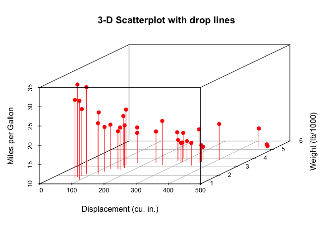
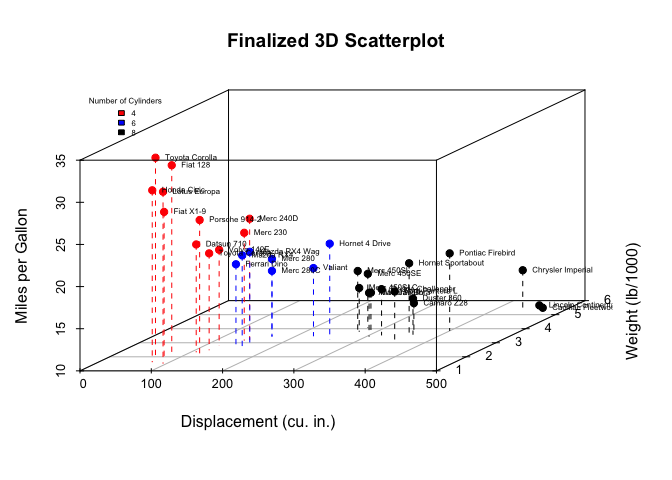
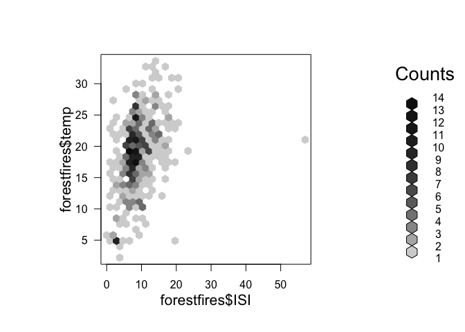
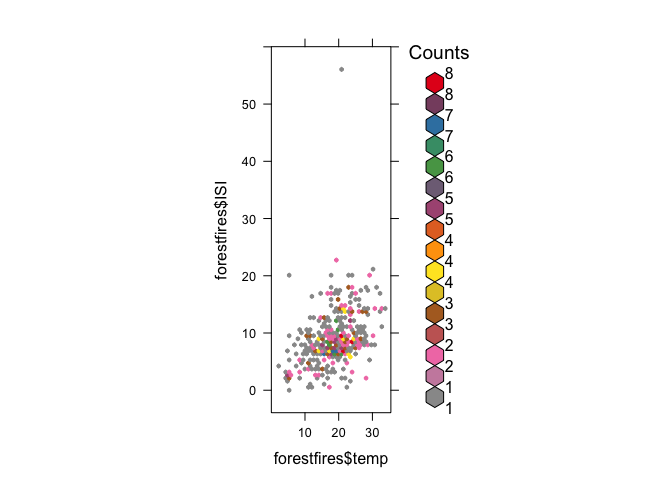

# 3D Scatterplots, Binning, and Interative Maps: Making the Best Use of Diverse R Packages 
Hannah Kim  
November 24, 2017  

```r
# loading fundamental packages
library(readr)
library(scatterplot3d)
library(hexbin)
library(leaflet)
library(dplyr)
```

## Introduction & Motivation
Data visualization is increasingly becoming a relevant topic in the realm of statistics, data science, and even business. There are programs like Tableau that generate compelling visualizations for stakeholders and people who have less experience with programming to take advantage of. Data visualizations are not only applicable in statistical fields, but are also efficient in that they accelerate decision-making processes to potential investors in businesses. 

With ever increasing volume of data in today’s world, it is impossible to tell stories without these visualizations. While there are tools like Tableau, I believe nothing can replace statistical packages that have good visualization capabilities. I believe that large data sets and trends are useless if you aren't able to visualize the data properly in digestible means for other people to understand. This is why I decided to dedicate this post to exploring other visualization examples in R, since it is a topic I am very interested in.
We will specifically look into scatterplots (including 3D and other features), hexbin binning, and map visualizations.

The following image is a Tableau visualization for your reference:


## Background / History
Data visualization has actually been around for much longer than we think. "Prior to the 17th century, data visualization existed mainly in the realm of maps, displaying land markers, cities, roads, and resources." And then in the 18th century we see thematic mapping, where abstract graphs of functions, measuremeant errors, and collection of empirical data were introduced. The latter half of the 19th century is usually called the Golden Age of statistical graphics because there was a growing recognition for the importance of numerical data in social planning, medicine, military, industrialization, commerce, and transportation. However, the power of data visualizations was greatly impacted through the emergence of computer processing. Computers gave statisticians the ability to collect and store data in increasingly large volumes, and this power of computers has also increased the ability to visualize data quickly and easily. We currently live in an exciting time for data visualizations, and it'd be interesting to see how the power of data will continue to thrive over time. [1]


## Examples

### 1. 3D Scatterplots

**3D scatterplots** are "used to plot data points on three axes in the attempt to show the relationships between three variables. Each row in the data table is represented by a marker whose position depends on its values in the columns set on the X, Y, and Z axes." A color or symbol on the data points could potentially represent a fourth variable! [2] 

The following code walks through how to generate a 3D scatterplot using the package `scatterplot3d`. To plot this graph, I received guidance from [this source](https://www.r-bloggers.com/getting-fancy-with-3-d-scatterplots/) [3].
  
Let’s say that we want to plot automobile mileage vs. engine displacement vs. car weight using the data in the `mtcars` dataframe.

`mpg` = miles per gallon
`disp` = displacement
`wt` = weight

```r
with(mtcars, {
   scatterplot3d(disp,   # x axis
                 wt,     # y axis
                 mpg,    # z axis
                 main = "3-D Scatterplot mpg vs. disp vs. wt")
})
```

<!-- -->

Next, we can also modify the graph so that the points are now color coded, making the graph more visually appealing. In addition, we can add drop lines to the x-y plane, making it easier to read the data points.

```r
with(mtcars, {
   scatterplot3d(disp, wt, mpg,        
                 color = "red", pch=19,  # new red points
                 type = "h",             # lines to the horizontal plane
                 main = "3-D Scatterplot with drop lines",
                 xlab = "Displacement (cu. in.)",
                 ylab = "Weight (lb/1000)",
                 zlab = "Miles per Gallon")
})
```

<!-- -->

Now we can make the points more meaninful by adding labels to them. 

You would want to save the results of the `scatterplot3d()` function to another variable, using `xyz.convert()` to convert the 3D (x, y, z) coordinates to 2D-projections (x, y). Then, we can use the `text()` function to add labels to the plot. 

```r
with(mtcars, {
   scatter3d <- scatterplot3d(disp, wt, mpg,        
                 color = "red", pch=19,         # new red points
                 type = "h",                    # vertical lines to the x-y plane
                 main = "3-D Scatterplot with drop lines and labels",
                 xlab = "Displacement (cu. in.)",
                 ylab = "Weight (lb/1000)",
                 zlab = "Miles per Gallon")
    scatter3d.coords <- scatter3d$xyz.convert(disp, wt, mpg) # convert 3D coordinatess to 2D projection
    text(scatter3d.coords$x, scatter3d.coords$y,             # new x and y coordinates
         labels = row.names(mtcars),               # add labels to plot
         cex = .5, pos = 4)           # shrink text 50% and place to right of points)
})
```

<!-- -->

Finally, we can then now add information on the number of cylinders that each car has. We can add a column to the `mtcars` dataframe so that it indicates the color for each point. Then we'll scale the y-axis, change the drop lines to dotted lines, and add a legend, so that the visualization is easier to understand.

```r
# create column indicating point color
mtcars$pcolor[mtcars$cyl == 4] <- "red"
mtcars$pcolor[mtcars$cyl == 6] <- "blue"
mtcars$pcolor[mtcars$cyl == 8] <- "black"

with(mtcars, {
    scatter3d <- scatterplot3d(disp, wt, mpg,        
                  color = pcolor, pch = 19,        # indicates number of cylinders
                  type = "h", lty.hplot = 2,       # lines to the horizontal plane
                  scale.y = .75,                   # scale y axis (reduce by 25%)
                  main = "Finalized 3D Scatterplot",
                  xlab = "Displacement (cu. in.)",
                  ylab = "Weight (lb/1000)",
                  zlab = "Miles per Gallon")
    
     scatter3d.coords <- scatter3d$xyz.convert(disp, wt, mpg)
     text(scatter3d.coords$x, scatter3d.coords$y,     
          labels = row.names(mtcars),       # add labels
          pos=4, cex=.5)                    # shirnk text
     
# add the legend
legend("topleft", inset=.05,      # location and inset
    bty="n", cex=.5,              # suppress legend box, shrink text by 50%
    title="Number of Cylinders",
    c("4", "6", "8"), fill=c("red", "blue", "black"))
})
```

<!-- -->

### 2. Hexbin binning
Binning is a technique of data aggregation used for grouping a dataset of N values into less than N discrete groups. There are many reasons for using hexagons instead of squares for binning a 2D surface as a plane. The most evident is that hexagons are more similar to circle than square. This translates in more efficient data aggregation around the bin center. This can be seen by looking at some particular properties of hexagons and, especially, of the hexagonal tessellation. [4] I received guidance through [this website](https://www.analyticsvidhya.com/blog/2015/07/guide-data-visualization-r/). [5]


We will use the [Forest Fires data set](http://archive.ics.uci.edu/ml/datasets/Forest+Fires) [6] from UCI's Machine Learning repository. 

Here are the following column labels of the data set:

  1. X: x-axis spatial coordinate within the Montesinho park map: 1 to 9 
  
  2. Y: y-axis spatial coordinate within the Montesinho park map: 2 to 9 
  
  3. month: month of the year: 'jan' to 'dec' 
  
  4. day: day of the week: 'mon' to 'sun' 
  
  5. FFMC: Fine Fuel Moisture Code index from the Forest Fire Weather Index (FWI) system: 18.7 to 96.20 
  
  6. DMC: Duff Moisture Code index from the FWI system: 1.1 to 291.3 
  
  7. DC: Drought Code index from the FWI system: 7.9 to 860.6 
  
  8. ISI: Initial Spread Index from the FWI system: 0.0 to 56.10 
  
  9. temp: temperature in Celsius degrees: 2.2 to 33.30 
  
  10. RH: relative humidity in %: 15.0 to 100 
  
  11. wind: wind speed in km/h: 0.40 to 9.40 
  
  12. rain: outside rain in mm/m2 : 0.0 to 6.4 
  
  13. area: the burned area of the forest (in ha): 0.00 to 1090.84 
  

Term clarifications: 

- *Fine Fuel Moisture Code (FFMC)*: Litter layer, and other cured fine fuels; Plays a significant role in ignition probability and spread 

- *Duff Moisture Code (DMC)*: Loosely compacted, fermenting (decomposing) organic matter; Contributes to lightning receptivity and over all fire intensity

- *Drought Code (DC)*: Deep layer of compact humus (decomposed) organic matter; Contributes to depth of burn, intensity, and suppression difficulty 

- *Initial Spread Index (ISI)*: Combines FFMC and wind speed; Varies greatly based on current wind conditions [7]


```r
# loading the forest fires data set and reading csv file
forestfires <- read_csv("data/forestfires.csv")
```

```
## Parsed with column specification:
## cols(
##   X = col_integer(),
##   Y = col_integer(),
##   month = col_character(),
##   day = col_character(),
##   FFMC = col_double(),
##   DMC = col_double(),
##   DC = col_double(),
##   ISI = col_double(),
##   temp = col_double(),
##   RH = col_integer(),
##   wind = col_double(),
##   rain = col_double(),
##   area = col_double()
## )
```


```r
# Notice that we already loaded the hexbin package on the top of this document

# set dataframe; ISI is the x coordinate and temp is the y coordinate
ISI_temp = hexbin(forestfires$ISI, forestfires$temp, xbins = 30)

# load color pallete
library(RColorBrewer)

# plot graph
plot(ISI_temp)
```

<!-- -->

Now, we use`colorRampPalette()` to add color onto the hexbin plot.

```r
# adding color 
rf <- colorRampPalette(rev(brewer.pal(30,'Set1')))
```

```
## Warning in brewer.pal(30, "Set1"): n too large, allowed maximum for palette Set1 is 9
## Returning the palette you asked for with that many colors
```

```r
hexbinplot(forestfires$ISI~forestfires$temp, data = forestfires, colramp = rf)
```

<!-- -->
  
### 3. Map Visualizations
**Map Visualizations** are used to pinpoint certain areas on a map from Geographic Information Systems (GIS) data. Mapping, charting, and visualization are three components of production mapping. Production mapping refers to a repeatable and automated process of producing maps and charts of GIS data. [8] Specifically in this example, we will be using the package called `leaflet`. Leaflet is one of the most popular open-source Javascript libraries for interactive maps! The source that I used for this graph is also [this source](https://www.analyticsvidhya.com/blog/2015/07/guide-data-visualization-r/).

You can see through the code that generating this type of visualization is actually rather simple. That's what makes leaflet so much more efficient than utilizing other complicated interactive maps.

```r
# we already loaded the leaflet package on the top of the file

map_viz <- leaflet() %>%

# add layers to the map by using layer functions (e.g. addTiles, addMarkers) to modify the map widget
addTiles() %>%  
addMarkers(lng = 174.768, lat = -36.852, popup = "The birthplace of R")

# print map
map_viz  
```

<!--html_preserve--><div id="htmlwidget-0ab7aa1fdc3e08c38993" style="width:672px;height:480px;" class="leaflet html-widget"></div>
<script type="application/json" data-for="htmlwidget-0ab7aa1fdc3e08c38993">{"x":{"options":{"crs":{"crsClass":"L.CRS.EPSG3857","code":null,"proj4def":null,"projectedBounds":null,"options":{}}},"calls":[{"method":"addTiles","args":["//{s}.tile.openstreetmap.org/{z}/{x}/{y}.png",null,null,{"minZoom":0,"maxZoom":18,"maxNativeZoom":null,"tileSize":256,"subdomains":"abc","errorTileUrl":"","tms":false,"continuousWorld":false,"noWrap":false,"zoomOffset":0,"zoomReverse":false,"opacity":1,"zIndex":null,"unloadInvisibleTiles":null,"updateWhenIdle":null,"detectRetina":false,"reuseTiles":false,"attribution":"&copy; <a href=\"http://openstreetmap.org\">OpenStreetMap<\/a> contributors, <a href=\"http://creativecommons.org/licenses/by-sa/2.0/\">CC-BY-SA<\/a>"}]},{"method":"addMarkers","args":[-36.852,174.768,null,null,null,{"clickable":true,"draggable":false,"keyboard":true,"title":"","alt":"","zIndexOffset":0,"opacity":1,"riseOnHover":false,"riseOffset":250},"The birthplace of R",null,null,null,null,null,null]}],"limits":{"lat":[-36.852,-36.852],"lng":[174.768,174.768]}},"evals":[],"jsHooks":[]}</script><!--/html_preserve-->

## Discussion

I would like to end my post with a few reasons why these types of data visualizations are so crucial. 

1. With the 3D scatterplot, we explored the `scatterplot3d` package. The funtion is relatively easy to use because it works like the coordinates (x, y, z). The 3D scatterplot is useful in real-life applications when companies want to assess the quality of their data in 3 different dimensions!

2. For hexbin binning, the `hexbin` package came in handy. This type of plotting is crucial for bivariate data points and is particularly useful for companies that are dealing with large data sets. The different color shadings on the plot also serve as helpful visualization qualities.

3. Lastly, for map visualizations, we specifically looked into the `leaflet` package. There are many ways to generate map visualizations (i.e. `ggmap`), but `leaflet` is convenient because it is relatively easy to create and incorporates a useful Javascript library.


## Conclusion
And that's the end of my post! We looked at three new data visualizations that could be generated using different packages: 3D scatterplots, hexbin binning, and map visualizations. The main takeaway was to explore different packages in R that generate useful, efficient data visualizations that can be utilized in various fields. 3D scatterplots visualize relations between continuous variables. Hexbin binning allows adjacent pixels to be combined and provides special insights through color coding and plot shape. Lastly, map visualization, through the leaflet package, is a great way to effectively point to a specific location. Interactive maps are common visual tools in business settings, so it can also be seen as a very applicable visualization. All in all, all of these R packages and data visualizations are applicable and useful.

## References

[1] http://www.dashboardinsight.com/news/news-articles/the-history-of-data-visualization.aspx

[2] https://docs.tibco.com/pub/spotfire/6.5.1/doc/html/3d_scat/3d_scat_what_is_a_3d_scatter_plot.htm

[3] https://www.r-bloggers.com/getting-fancy-with-3-d-scatterplots/

[4] http://www.meccanismocomplesso.org/en/hexagonal-binning/

[5] https://www.analyticsvidhya.com/blog/2015/07/guide-data-visualization-r/

[6] http://archive.ics.uci.edu/ml/datasets/Forest+Fires

[7] https://www.frames.gov/files/6014/1576/1411/FWI-history.pdf

[8] http://desktop.arcgis.com/en/arcmap/latest/extensions/production-mapping/what-is-mapping-charting-and-visualization.htm
